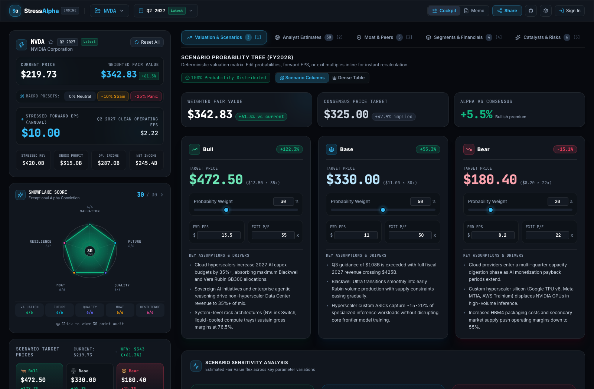
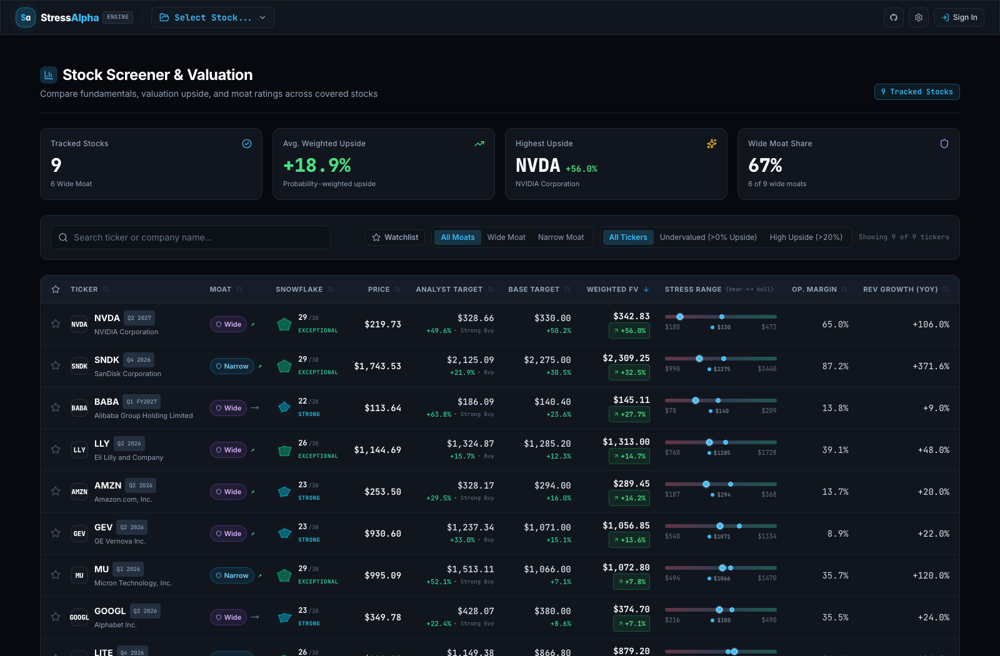
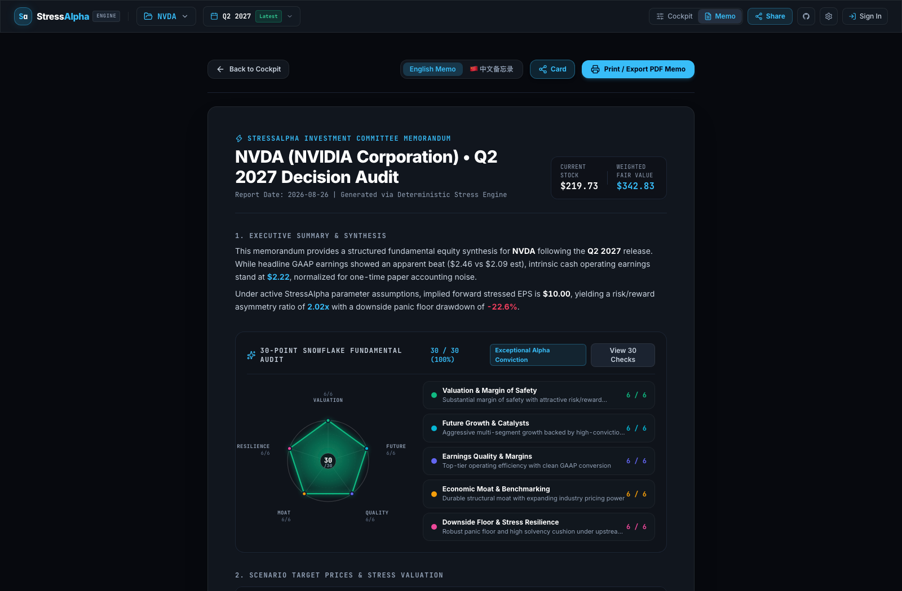
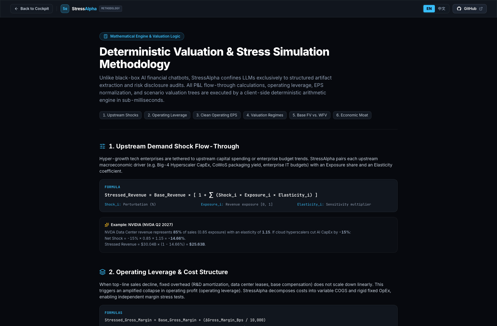

# StressAlpha — Modern Equity Earnings & Stress Simulation Platform

A forward-looking financial decision and scenario-simulation platform for fundamental equity analysts, tech investors, and quant researchers. Built as a high-performance **Next.js 16 App Router** application (powered by **React 19** and **Turbopack**) with pure client-side deterministic arithmetic, dynamic valuation bands, and an autonomous AI pipeline skill.

<p align="center">
  
</p>

---

## 🚀 Key Features

### 1. Cross-Ticker Universe Screener & Comparison Table
- **Market-Wide Valuation Radar:** Cross-ticker table comparing all covered companies (NVDA, AMZN, GOOGL, BABA, GEV, LLY, MU, LITE) side-by-side.
- **Valuation Spectrum Bars:** Visual Bear $\leftrightarrow$ Market Price $\leftrightarrow$ Base $\leftrightarrow$ Bull spread bars showing which stocks trade at deep discounts to Base Case fair value.
- **Fundamental Screening:** Real-time search and filter by Economic Moat (*Wide / Narrow*), valuation discount (*Undervalued / High Upside >20%*), margins, and growth.
- **1-Click Navigation:** Launch directly into any ticker's cockpit or memorandum from the table or by pressing the **`S`** hotkey.

<p align="center">
  
</p>

### 2. Live Database & Direct Report Selector
- **Neon Serverless Postgres + Drizzle ORM:** Enterprise-grade database backend with typed JSONB columns bound to Zod validation schemas.
- **Nightly Market Price Sync:** Automated GitHub Actions cron updates live closing prices across the coverage universe every trading day at 5:00 PM EST.
- **High-Performance In-Memory Repository:** Serves directly from Neon Serverless PostgreSQL with a 60-second in-memory server cache and client-side memory caching, delivering <5ms response times.
- Live API endpoints:
  - `GET /api/reports`: Queries summaries, live stock prices, snowflake scores, and dynamic valuation metrics.
  - `GET /api/reports/[slug]`: Serves the complete artifact bundle for a selected report.
- URL deep-linking: `http://localhost:3000/?report=NVDA-Q2-2027-analysis&mode=cockpit` and dedicated `http://localhost:3000/screener`.

### 3. Sticky Flow-Through Cockpit
- **Live P&L Strip:** Stressed Revenue, Gross Profit, Operating Income, Net Income, and Stressed Diluted EPS.
- **Valuation Outcome Regimes:**
  - 🐂 **Bull Regime:** Multiple expansion / enterprise acceleration scenario.
  - ⚖️ **Base Regime:** Normalized multiple and guidance execution.
  - 🚨 **Panic Floor:** Multiple de-rating and recessionary drawdown floor.
- **Visual Valuation Meter:** Real-time gauge pin positioning current stock price against panic and bull regime boundaries.
- **2x2 Risk Asymmetry Matrix:** Calculates Upside to Bull, Downside to Panic, Priced-In Multiple, and Risk/Reward Asymmetry Skew.
- **Upstream Demand Shock Sliders:** Continuous sensitivity sliders (<1ms response) perturbing Hyperscaler CapEx, Consumer Demand, Digital Ad Budgets with exposure shares and elasticities.
- **Operating Margin & Leverage Controls:** Perturb gross margin (bps) and fixed OpEx shifts (%).
- **Income Quality Guardrail:** Identifies and strips non-operating one-time gains (e.g. Amazon's $53.4B Anthropic unrealized paper mark under ASU 2016-01) to surface the true Operating EPS.

### 4. Quantitative Probability Calibration Engine (QPCE)
- **Logit-Space Bayesian Calibration:** Replaces naive symmetrical priors (e.g. 25/50/25) with deterministic multinomial log-odds calibration ($z_i = \ln(p_i) + \Delta z_i$) and temperature-controlled Softmax, bounded by $\epsilon = 0.05$ simplex contraction ($p_i \in [0.05, 0.85], \sum p_i \equiv 1.000$).
- **Forensic & Governance Veto (Pillar 1):** Severe governance risk, auditor resignations, or DOJ investigations trigger an institutional lexicographic override capping Bull ($\le 8\%$) and flooring Panic ($\ge 45\%$), preventing high gross margins from masking accounting fraud (Wirecard/Enron guardrail).
- **Archetype-Aware Calibration & Cash Runway (Pillar 2):**
  - **Archetype A (`compounder`):** Mature cash cows with operating margins $>30\%$ rewarded; $<15\%$ penalized unless protected by durable Wide Moat (`Costco Compounder Exemption`).
  - **Archetype B (`operating_scaler`):** Fast growers ($\ge 25\%$) with gross margins $\ge 60\%$ rewarded for operating leverage acceleration (e.g. RDDT, NOW, PLTR).
  - **Archetype C (`venture_hypergrowth`):** Scale-up companies ($\ge 50\%$ growth, negative operating income, e.g. ONDS). Gated by a mandatory gross margin floor ($\ge 35\%$) to grant the **Unit Economics Exemption** (waiving operating margin penalties for capital-reinvesting growth). Audits **Net Liquid Runway** ($\tau_{\text{net}} = (\text{cash} - \text{short-term debt}) / \text{monthly burn}$), applying an acute dilution penalty ($\Delta z_{\text{panic}} = +1.25, \Delta z_{\text{bull}} = -1.10$) if runway $<9$ months.
- **Sell-Side Consensus Skew & Dispersion (Pillar 3):** Calibrates Wall Street ratings and price target dispersion into the scenario probability distribution.
- **Market-Price Bayesian Shrinkage Anchor (Pillar 4):** Anchors scenarios against the market-implied multiple ($w_{\text{mkt}} = 0.20$) to ground models in market reality without sacrificing fundamental alpha discovery.

### 5. Intelligence Workspace Tabs (7 Workspaces)
- **1. Valuation & Scenario Tree:** Interactive Bull/Base/Bear matrix with inline-editable forward EPS and exit multiples, real-time fair value recalculation, and integrated parameter sensitivity analysis.
- **2. Wall Street Estimates:** Sell-side consensus ratings, price target track (Low/Mean/Median/High), and analyst revision histories.
- **3. Economic Moat:** 5-pillar economic moat evaluation (Intangible Assets, Switching Costs, Cost Advantage, Network Effects, Efficient Scale) and peer comparison matrix.
- **4. Segments & Guidance:** Segment revenue breakdowns, YoY velocities, and management forward guidance ranges.
- **5. Catalysts:** Directional growth and risk drivers with quantified probability anchors, horizons, and interactive weight sliders.
- **6. Audit & Risk:** Consolidated audit workspace containing 10-Q SEC risk disclosures, management tone scorecard, and historical post-earnings price reactions.
- **7. Full Report Markdown:** View bilingual reports (`report.md` / `report_zh.md`) with 1-click clipboard copy.

### 6. Investment Committee Memo Mode
- Toggle with one click (`[M]` key) into a publication-ready 1-page PDF / printable memorandum for investment committee review.

<p align="center">
  
</p>

### 7. Deterministic Valuation Methodology & Formula Guide (`/methodology`)
- Comprehensive interactive documentation page explaining all mathematical algorithms and accounting guardrails powering the platform.
- Full mathematical breakdowns, parameter definitions, and worked real-world examples (e.g. NVDA CapEx elasticity, AMZN ASU 2016-01 mark-to-market normalization, SMCI governance veto probability calibration).
- Accessible anytime from the top navigation bar or via direct route `/methodology`, complete with instant bilingual EN/中文 switching and GitHub links.

<p align="center">
  
</p>

---

## 🤖 AI Skill Integration (`stress-alpha`)

StressAlpha includes a dedicated AI Skill installed at:
- Project level: [`.agents/skills/stress-alpha/SKILL.md`](./.agents/skills/stress-alpha/SKILL.md)
- Global level: `~/.agents/skills/stress-alpha/SKILL.md`

### Running the Complete Flow with 1 Command:
```bash
# Analyze and display a report in the web app
/Users/krding/Projects/stress-alpha/scripts/run_flow.sh AMZN-Q2-2026-analysis
```

### CLI Analysis Engine:
```bash
# Compute deterministic valuation, render markdown & persist directly to Neon DB
npx tsx scripts/analyze.ts LITE-Q4-2026-analysis
```

---

## 🛠️ Project Structure

```
stress-alpha/
├── package.json                      # Next.js 16 + React 19 dependencies
├── tsconfig.json                     # TypeScript configuration (react-jsx)
├── tailwind.config.ts                # Styling configuration with font variables
├── drizzle.config.ts                 # Drizzle ORM configuration for Neon Postgres
├── next.config.mjs                   # Next.js configuration
├── eslint.config.mjs                 # Flat ESLint configuration (core-web-vitals)
├── .github/workflows/
│   ├── ci.yml                        # GitHub Actions CI workflow (lint, test, build)
│   └── nightly-price-sync.yml        # Nightly 5:00 PM EST market price sync
├── docs/
│   ├── architecture.md               # Canonical system architecture documentation
│   ├── spec-neon-drizzle.md          # Neon Postgres + Drizzle ORM technical spec
│   ├── spec-multi-quarter-earnings.md# Multi-quarter historical earnings specification
│   └── images/                       # High-res UI preview screenshots
├── prompts/                          # LLM audit & extraction prompt templates
├── scripts/
│   ├── analyze.ts                    # CLI valuation & DB persistence engine
│   ├── sync_prices.ts                # Standalone Yahoo Finance market price sync
│   ├── migrate_to_neon.ts            # One-time migration seeder into Neon DB
│   ├── fetch_analyst_estimates.py    # Yahoo Finance consensus extractor
│   ├── capture_screenshots.sh        # Headless Chrome snapshot capture script
│   ├── run_flow.sh                   # Flow runner
│   └── open_report.sh                # Browser opener
├── src/
│   ├── app/
│   │   ├── layout.tsx                # App layout (next/font/google)
│   │   ├── page.tsx                  # Main dashboard (Cockpit + Intelligence Workspaces)
│   │   ├── screener/                 # Dedicated standalone screener route (/screener)
│   │   ├── globals.css               # Theme & styles
│   │   ├── methodology/page.tsx      # Formula documentation page
│   │   └── api/
│   │       ├── auth/[...all]/        # Better Auth session & authentication endpoints
│   │       ├── watchlist/            # Cloud watchlist persistence
│   │       └── reports/              # API endpoints for summaries and reports
│   ├── components/
│   │   ├── Header.tsx                # Navigation, mode toggle & quick actions
│   │   ├── Cockpit.tsx               # Sticky left flow-through simulator
│   │   ├── ScreenerView.tsx          # Multi-ticker universe screener with live prices
│   │   ├── ReportSelector.tsx        # Streamlined ticker selector
│   │   ├── QuarterSwitcher.tsx       # Multi-quarter history navigation pill
│   │   ├── PriceMeter.tsx            # Visual price range meter
│   │   ├── MemoView.tsx              # Committee memorandum mode
│   │   ├── AuthModal.tsx             # Better Auth sign-in / sign-up modal
│   │   ├── snowflake/                # 5-Pillar Snowflake Radar chart & modal
│   │   ├── social-card/              # Institutional social media card generator
│   │   └── tabs/                     # 7 Focused intelligence workspaces
│   ├── db/
│   │   ├── schema.ts                 # Drizzle PostgreSQL schema (tickers, reports, auth)
│   │   └── index.ts                  # Neon serverless client & connection pooling
│   └── lib/
│       ├── schemas.ts                # Zod schemas & types
│       ├── valuation.ts              # Deterministic arithmetic engine
│       ├── snowflake.ts              # 30-point 5-pillar fundamental radar scorer
│       ├── social-card.ts            # High-res social export cards
│       ├── watchlist.ts              # Cloud & localStorage hybrid watchlist hook
│       ├── auth.ts                   # Better Auth server configuration
│       ├── auth-client.ts            # Better Auth React client
│       ├── url-state.ts              # URL search param state sync & serializer
│       ├── report.ts                 # Bilingual markdown report generator
│       ├── i18n.ts                   # Centralized internationalization dictionary
│       └── repository/               # Data Access Layer (DAL)
│           ├── types.ts              # IReportRepository interface
│           ├── drizzle-report-repository.ts # Neon Postgres implementation with live prices & 60s cache
│           ├── in-memory-report-repository.ts # In-memory mock repository for tests
│           └── index.ts              # Repository factory singleton
└── tests/                            # Vitest unit test suite (111 tests across 12 suites)
    ├── auth.test.ts
    ├── multi-quarter.test.ts
    ├── report.test.ts
    ├── repository.test.ts
    ├── schemas.test.ts
    ├── screener.test.ts
    ├── snowflake.test.ts
    ├── social-card.test.ts
    ├── url-state.test.ts
    ├── utils.test.ts
    ├── valuation.test.ts
    └── watchlist.test.ts
```

---

## 🏃 Getting Started

1. **Install dependencies:**
   ```bash
   npm install
   ```

2. **Configure Database (Neon PostgreSQL):**
   Copy `.env.example` to `.env.local` and add your Neon connection string:
   ```bash
   cp .env.example .env.local
   # Set DATABASE_URL in .env.local
   ```

3. **Push database schema & seed initial reports:**
   ```bash
   npm run db:push
   npm run migrate:neon
   ```

4. **Run nightly price sync manually (optional):**
   ```bash
   npm run sync:prices
   ```

5. **Run test suite & verify build:**
   ```bash
   npm test
   npm run test:coverage
   npm run build
   ```

6. **Run development server:**
   ```bash
   npm run dev
   ```

7. **Open browser:**
   ```
   http://localhost:3000
   ```
