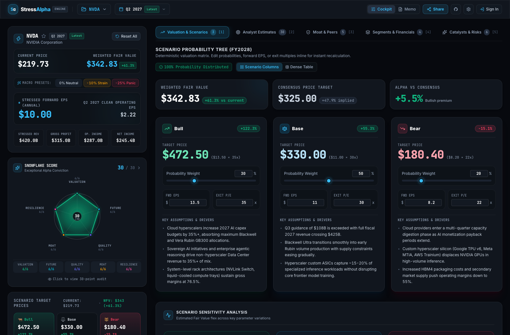
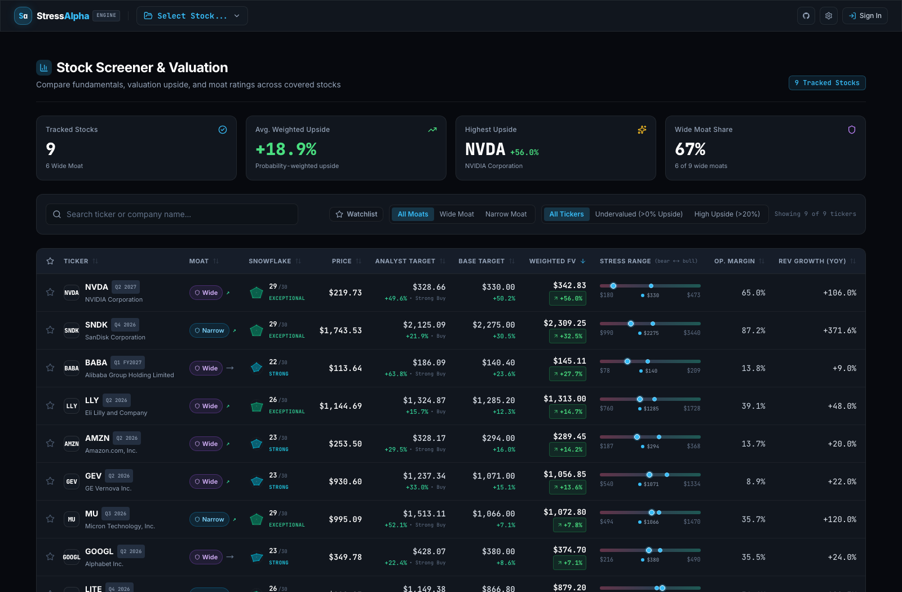
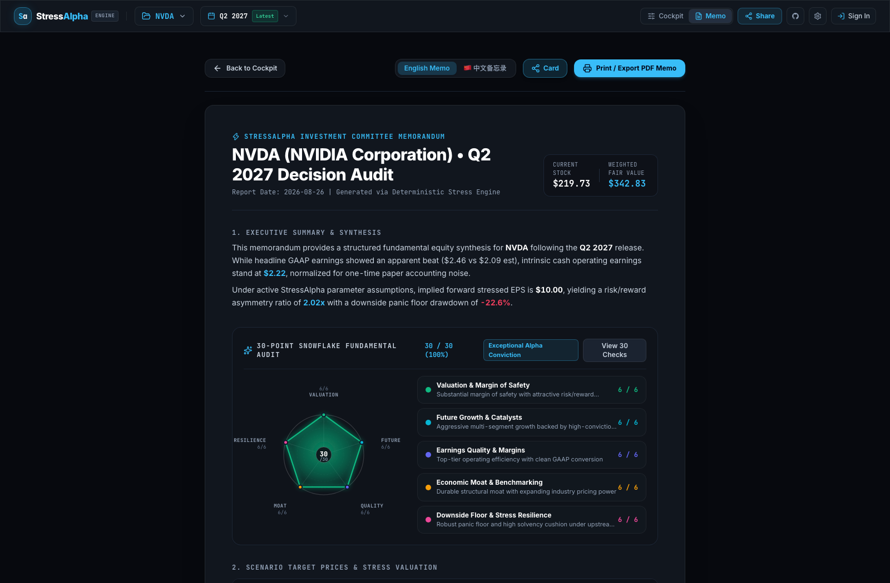
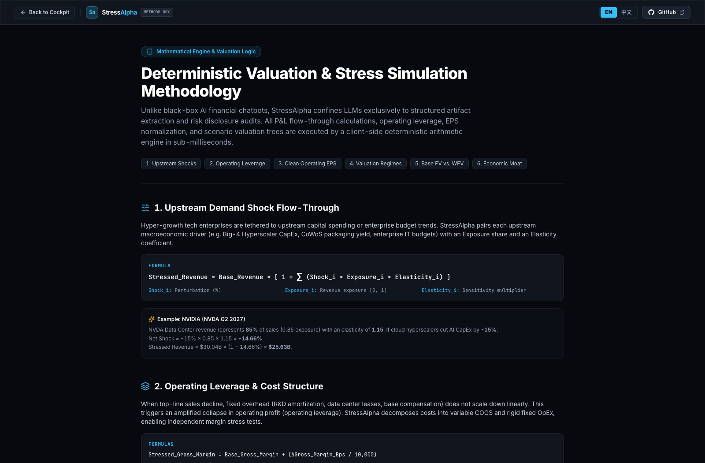

# StressAlpha — Modern Equity Earnings & Stress Simulation Platform

A forward-looking financial decision and scenario-simulation platform for fundamental equity analysts, tech investors, and quant researchers. Built as a high-performance **Next.js 16 App Router** application (powered by **React 19** and **Turbopack**) with pure client-side deterministic arithmetic, dynamic valuation bands, and an autonomous AI pipeline skill.

<p align="center">
  
</p>

---

## 🚀 Key Features

### 1. Cross-Ticker Universe Screener & Comparison Table
- **Market-Wide Valuation Radar:** Cross-ticker table comparing all covered companies (NVDA, AMZN, GOOGL, BABA, GEV, LLY, MU, LITE) side-by-side.
- **Valuation Spectrum Bars:** Visual Bear $\leftrightarrow$ Market Price $\leftrightarrow$ Base $\leftrightarrow$ Bull spread bars showing which stocks trade at deep discounts to Base Case fair value.
- **Fundamental Screening:** Real-time search and filter by Economic Moat (*Wide / Narrow*), valuation discount (*Undervalued / High Upside >20%*), margins, and growth.
- **1-Click Navigation:** Launch directly into any ticker's model or memorandum from the table or by pressing the **`S`** hotkey.

<p align="center">
  
</p>

### 2. Live Database & Direct Report Selector
- **Neon Serverless Postgres + Drizzle ORM:** Enterprise-grade database backend with typed JSONB columns bound to Zod validation schemas.
- **Nightly Market Price Sync:** Automated GitHub Actions cron updates live closing prices across the coverage universe every trading day at 5:00 PM EST.
- **High-Performance In-Memory Repository:** Serves directly from Neon Serverless PostgreSQL with a 60-second in-memory server cache and client-side memory caching, delivering <5ms response times.
- Live API endpoints:
  - `GET /api/reports`: Queries summaries, live stock prices, snowflake scores, and dynamic valuation metrics.
  - `GET /api/reports/[slug]`: Serves the complete artifact bundle for a selected report.
  - `GET /api/pipeline/data?ticker=NVDA`: Fetches point-in-time SEC statements, consensus targets, and broker revisions.
  - `POST /api/pipeline/data`: Automated financial data ingestion and staging for public equities.
- URL deep-linking: `http://localhost:3000/?report=NVDA-Q2-2027-analysis&mode=cockpit`, dedicated Screener `http://localhost:3000/screener`, and dedicated Watchlist `http://localhost:3000/watchlist`.

### 3. Dedicated Watchlist & Portfolio Analytics
- **Core Coverage Tracking:** Dedicated standalone route (`/watchlist`) accessible from the top header segmented navigation bar `[ ★ Watchlist (count) ]` with live dynamic count badge.
- **Top Portfolio Telemetry Strip:** Real-time aggregate KPI metrics across your tracked universe (Tracked Equities, Avg Fair Value Upside %, Conviction Leader, Wide Moat Share %, Avg Snowflake Health / 30).
- **Multi-Quarter Grouping:** Automatically groups historical coverage quarters under each tracked ticker, featuring the latest quarter's valuation while offering 1-click pills to jump to past quarters (`Q2 27 [Latest] · Q1 27 · Q4 26 ...`).
- **4-Regime Valuation Bounds:** Visualizes Panic Floor / Bear $\leftrightarrow$ Base $\leftrightarrow$ Bull valuation spreads alongside real-time current price pin and weighted fair value (WFV) metrics.
- **Sell-Side Variant Perception:** Highlights Wall Street consensus targets and calculates consensus divergence spreads with conviction tier badges (*Extreme Divergence*, *High Conviction Alpha*, *Moderate Alpha*, *In Line*).
- **5-Pillar Snowflake Breakdown:** Displays both the circular 30-point radar chart and individual breakdown bars for Valuation & Safety, Future Growth & Catalysts, Earnings Quality & Margins, Economic Moat, and Downside Floor.
- **Dual View Modes:** Seamlessly toggle between Deep-Dive Cards and Matrix Table views.

### 4. Interactive Flow-Through Stress Model
- **Live P&L Strip:** Stressed Revenue, Gross Profit, Operating Income, Net Income, and Stressed Diluted EPS.
- **Valuation Outcome Regimes:**
  - 🐂 **Bull Regime:** Multiple expansion / enterprise acceleration scenario.
  - ⚖️ **Base Regime:** Normalized multiple and guidance execution.
  - 🚨 **Panic Floor:** Multiple de-rating and recessionary drawdown floor.
- **Visual Valuation Meter:** Real-time gauge pin positioning current stock price against panic and bull regime boundaries.
- **2x2 Risk Asymmetry Matrix:** Calculates Upside to Bull, Downside to Panic, Priced-In Multiple, and Risk/Reward Asymmetry Skew.
- **Upstream Demand Shock Sliders:** Continuous sensitivity sliders (<1ms response) perturbing Hyperscaler CapEx, Consumer Demand, Digital Ad Budgets with exposure shares and elasticities.
- **Operating Margin & Leverage Controls:** Perturb gross margin (bps) and fixed OpEx shifts (%).
- **Income Quality Guardrail:** Identifies and strips non-operating one-time gains (e.g. Amazon's $53.4B Anthropic unrealized paper mark under ASU 2016-01) to surface the true Operating EPS.

### 5. Quantitative Probability Calibration Engine (QPCE)
- **Logit-Space Bayesian Calibration:** Replaces naive symmetrical priors (e.g. 25/50/25) with deterministic multinomial log-odds calibration ($z_i = \ln(p_i) + \Delta z_i$) and temperature-controlled Softmax, bounded by $\epsilon = 0.05$ simplex contraction ($p_i \in [0.05, 0.85], \sum p_i \equiv 1.000$).
- **Forensic & Governance Veto (Pillar 1):** Severe governance risk, auditor resignations, or DOJ investigations trigger a lexicographic override capping Bull ($\le 8\%$) and flooring Panic ($\ge 45\%$), preventing high gross margins from masking accounting fraud (Wirecard/Enron guardrail).
- **Archetype-Aware Calibration & Cash Runway (Pillar 2):**
  - **Archetype A (`compounder`):** Mature cash cows with operating margins $>30\%$ rewarded; $<15\%$ penalized unless protected by durable Wide Moat (`Costco Compounder Exemption`).
  - **Archetype B (`operating_scaler`):** Fast growers ($\ge 25\%$) with gross margins $\ge 60\%$ rewarded for operating leverage acceleration (e.g. RDDT, NOW, PLTR).
  - **Archetype C (`venture_hypergrowth`):** Scale-up companies ($\ge 50\%$ growth, negative operating income, e.g. ONDS). Gated by a mandatory gross margin floor ($\ge 35\%$) to grant the **Unit Economics Exemption** (waiving operating margin penalties for capital-reinvesting growth). Audits **Net Liquid Runway** ($\tau_{\text{net}} = (\text{cash} - \text{short-term debt}) / \text{monthly burn}$), applying an acute dilution penalty ($\Delta z_{\text{panic}} = +1.25, \Delta z_{\text{bull}} = -1.10$) if runway $<9$ months.
- **Sell-Side Consensus Skew & Dispersion (Pillar 3):** Calibrates Wall Street ratings and price target dispersion into the scenario probability distribution.
- **Market-Price Bayesian Shrinkage Anchor (Pillar 4):** Anchors scenarios against the market-implied multiple ($w_{\text{mkt}} = 0.20$) to ground models in market reality without sacrificing fundamental alpha discovery.

### 6. Intelligence Workspace Tabs (7 Workspaces)
- **1. Valuation & Scenario Tree:** Interactive Bull/Base/Bear matrix with inline-editable forward EPS and exit multiples, real-time fair value recalculation, and integrated parameter sensitivity analysis.
- **2. Wall Street Estimates:** Sell-side consensus ratings, price target track (Low/Mean/Median/High), and analyst revision histories.
- **3. Economic Moat:** 5-pillar economic moat evaluation (Intangible Assets, Switching Costs, Cost Advantage, Network Effects, Efficient Scale) and peer comparison matrix.
- **4. Segments & Guidance:** Segment revenue breakdowns, YoY velocities, and management forward guidance ranges.
- **5. Catalysts:** Directional growth and risk drivers with quantified probability anchors, horizons, and interactive weight sliders.
- **6. Audit & Risk:** Consolidated audit workspace containing 10-Q SEC risk disclosures, management tone scorecard, and historical post-earnings price reactions.
- **7. Full Report Markdown:** View bilingual reports (`report.md` / `report_zh.md`) with 1-click clipboard copy.

### 7. Investment Committee Memo Mode
- Toggle with one click (`[M]` key) into a publication-ready 1-page PDF / printable memorandum for investment committee review.

<p align="center">
  
</p>

### 8. Deterministic Valuation Methodology & Formula Guide (`/methodology`)
- Comprehensive interactive documentation page explaining all mathematical algorithms and accounting guardrails powering the platform.
- Full mathematical breakdowns, parameter definitions, and worked real-world examples (e.g. NVDA CapEx elasticity, AMZN ASU 2016-01 mark-to-market normalization, SMCI governance veto probability calibration).
- Accessible anytime from the top navigation bar or via direct route `/methodology`, complete with instant bilingual EN/中文 switching and GitHub links.

<p align="center">
  
</p>

### 9. Global Dual-Theme Engine: Dark & Light
- **Dark (Default):** Signature dark terminal aesthetic featuring deep obsidian (`#07090e`), layered dark glassmorphic panels, cyan (`#38bdf8`) accent glow, and calibrated neon telemetry.
- **Light:** High-contrast FactSet/WSJ day mode designed for daytime research and review, featuring clean white/light slate surfaces (`#ffffff` / `#f8fafc`), high-contrast slate-900 typography (`#0f172a`), deep sky accent (`#0284c7`), and crisp, calibrated WCAG AA financial indicators.
- **Instant 1-Click Toggle:** Quick Sun/Moon switch in the top header and detailed switcher in Settings menu, with zero-flash (`0ms FOUC`) SSR persistence in `localStorage`.

### 10. Mobile-First Model & Universe Screener
- **Mobile Segmented Switcher (`[⚡ Model] [📊 Deep Dive (7)]`):** Eliminates 1800px vertical scroll fatigue on mobile screens, enabling 1-tap switching between stress test controls and the 7 fundamental workspaces.
- **Desktop Dual-Pane Independent Scroll Architecture:** Fixed viewport height on desktop (`h-[calc(100vh-3.5rem)]`) isolates the left stress testing Model and right intelligence workspaces into dedicated scroll viewports, completely eliminating global window scrollbars, height jumping, and scroll chaining.
- **Clear Information Architecture:** Primary header navigation features a Segmented Navigation Bar in the center: dynamically displaying the active stock ticker model (`[ ⚡ {TICKER} · Model ]` / `[ ⚡ {TICKER} · 模型 ]`) when a report has been visited, alongside `[ 📊 Screener ]` and `[ ★ Watchlist (count) ]` with live dynamic count badge for 1-click roundtrip navigation between universe screens and the valuation model; when no report has been visited, the model button remains hidden to keep the interface clean. Ticker and report quarter are unified into a single financial capsule (`ReportSelector`) with quick-switch quarter chips, multi-quarter history, and search; Research Memo is a clearly labeled `[ 📄 Research Memo [M] ]` action button docked at the right end of the workspace navigation ribbon.
- **Clutter-Free Workspace Navigation:**
  - **Sticky Frosted Glass Navigation Ribbon:** Matches the main Header's opacity (`0.90` dark / `0.92` light), heavy frosted glass blur (`backdrop-filter: blur(24px) saturate(180%)`), and border tokens, completely obscuring underlying scrolled text on mobile and docking statically above workspaces on desktop.
  - **Desktop Zero-Scroll Segmented Capsule:** Displays high-signal concise labels (`Valuation`, `Estimates`, `Moat`, `Segments`, `Catalysts`, `Audit`, `Notes` / `估值`, `共识`, `护城河`, etc.) on desktop screens (`lg:` to `2xl:`) so all 7 intelligence workspaces fit cleanly in a single row without horizontal scrollbars; full titles display on `2xl:`.
  - **Desktop Step Chevrons (`<` and `>`):** 1-click workspace paging right from the sticky top navigation bar, complete with shortcut hints (`[` and `]`).
  - **Mouse Wheel Horizontal Translation:** Scrolling vertically over the navigation ribbon smoothly moves tabs horizontally if viewport narrows, eliminating tiny scrollbar dragging.
  - **Mobile-Only Bottom Workspace Pager (`lg:hidden`):** Sequential bottom pager (`← Prev Workspace` | dots indicator | `Next Workspace →`) scoped strictly to mobile screens, avoiding redundant clutter on desktop.
  - **Desktop Floating "Back to Top" Action:** Automatically fades in when reading deep filing transcripts or analyst tables, smoothly returning to workspace top in 1 click.
  - **Instant Workspace Scroll-to-Top:** Automatically positions the new workspace at the top whenever navigating via tabs, chevrons, or keyboard shortcuts (`1-7`, `[`, `]`).
- **Adaptive Screener Cards:** Replaces cramped 11-column horizontal tables with high-legibility stock cards on mobile, complete with mini Snowflake radars, moat badges, base-to-bull price spectrum tracks, and 1-tap navigation to Model or Memo.
- **Slide-Over Navigation Drawer:** Full-featured touch-friendly drawer providing quick access to report history, quarter switching, Screener, language selection (EN/中文), and theme switcher.
- **Responsive Workspace Tabs:** Tailored mobile card views for Wall Street Analyst Estimates (`EstimatesTab`) and Peer Benchmarking (`MoatTab`), avoiding horizontal clipping and table pinch-to-zoom.

### 11. Event-Driven News & Supply Chain Transmission Pipeline
- **Zero-Hallucination News Transmission:** Instead of letting AI speculate on price targets from news, headlines are converted into structured transmission vectors (Upstream Driver Shocks, Catalyst Probabilities, Consensus Skews) that feed deterministically into the financial engine.
- **Deterministic Clickbait Filter:** High-speed regex & publisher blacklisting (`src/lib/news-filter.ts`) rejects ~95% of syndication spam and bot articles with 0 LLM cost.
- **Cross-Company Dependency Graph:** Directed Acyclic Graph (DAG) in Neon PostgreSQL (`upstreamDependenciesTable`) propagating supplier/customer earnings shocks (e.g. TSMC CapEx $\to$ NVIDIA revenue $\to$ Data Center power demand) without duplicating extractions.

### 12. Data Completeness & Variant Perception Audit
- **Defensive Data Integrity Gatekeeper:** Audits 8 quarterly modules (`facts`, `scenarios`, `baseline`, `moat`, `estimates`, `filing`, `sentiment`, `catalysts`) to compute a deterministic Data Completeness Score ($0-100\%$) and validate fatal invariants (ticker mismatch, non-positive price, undefined operating EPS, share count validity, probability simplex closure) before persisting to Neon DB.
- **Offensive Variant Perception Decomposition:** Quantifies consensus divergence ($\Delta = (\text{WFV} - T_{\text{cons}}) / T_{\text{cons}} \times 100\%$) into 4 analytical tiers (`in_line`, `moderate_alpha`, `high_conviction_alpha`, `extreme_divergence`). Decomposes alpha into Base Scenario multiple delta, earnings delta, and dynamic regime stress haircut.
- **On-Demand Inspection Modal:** Clean trigger badge in the model scenario cards opening a comprehensive attribution modal (`VariantPerceptionModal.tsx`) with zero layout clutter.

### 13. Dedicated Settings Page & Institutional Privacy Guardrail
- **Dedicated Settings Page (`/settings`):** Centralized hub to manage account security, theme preferences (Bloomberg Terminal Dark `#07090e` vs FactSet / WSJ Day Light `#f8fafc`), language dictionary selection (English & 简体中文), quantitative valuation mathematical models (QPCE simplex calibration, Operating EPS income guardrails), local cache management, and platform telemetry.
- **Zero-Exposure Email Privacy Guardrail:** Raw user emails are completely omitted from header menus, profile dropdowns, and mobile drawers by default to prevent shoulder-surfing and accidental disclosure during video recordings, presentations, or live screen sharing. On the private `/settings` page, emails are masked (`a***@domain.com`) with an intentional user-controlled visibility toggle.
- **Seamless Navigation:** Accessible via 1-click links in the desktop Header Settings dropdown, User Profile menu, and mobile navigation drawer.

---

## 🤖 AI Skill Integration (`stress-alpha`)

StressAlpha includes dedicated AI Skills for end-to-end fundamental and earnings audits:
- Project level: [`.agents/skills/stress-alpha/SKILL.md`](./.agents/skills/stress-alpha/SKILL.md) and [`.agents/skills/earnings/SKILL.md`](./.agents/skills/earnings/SKILL.md)
- Global level: `~/.agents/skills/stress-alpha/SKILL.md`
- **Audited Financial Feeds**: Seamlessly integrates with [Massive.com](https://massive.com/pricing) (for SEC point-in-time financial statements, ratios, and aggregates) and [Finnhub.io](https://finnhub.io/pricing) (for earnings call audio transcripts, SEC filings, and sell-side price targets/recommendations).

### Running the Complete Flow with Deterministic CLI:
```bash
# 1. Deterministic Data Ingestion & 8-Module Scaffolding (Live Feeds + Starter Drafts)
npm run fetch:data -- TSLA --stage

# 2. Local Pre-Flight & Valuation Verification (Dry-Run Mode, skips DB)
npm run analyze -- reports/TSLA-Q4-2025-analysis --dry-run

# 3. Compute Deterministic Valuation, Render Markdown & Persist to Neon DB
npm run analyze -- reports/TSLA-Q4-2025-analysis

# 4. Launch Cockpit in Web App
npm run open -- reports/TSLA-Q4-2025-analysis
```

---

## 🛠️ Project Structure

```
stress-alpha/
├── package.json                      # Next.js 16 + React 19 dependencies
├── tsconfig.json                     # TypeScript configuration (react-jsx)
├── tailwind.config.ts                # Styling configuration with font variables
├── drizzle.config.ts                 # Drizzle ORM configuration for Neon Postgres
├── next.config.mjs                   # Next.js configuration
├── eslint.config.mjs                 # Flat ESLint configuration (core-web-vitals)
├── .github/workflows/
│   ├── ci.yml                        # GitHub Actions CI workflow (lint, test, build)
│   └── nightly-price-sync.yml        # Nightly 5:00 PM EST market price sync
├── docs/
│   ├── architecture.md               # Canonical system architecture documentation
│   ├── spec-neon-drizzle.md          # Neon Postgres + Drizzle ORM technical spec
│   ├── spec-multi-quarter-earnings.md# Multi-quarter historical earnings specification
│   └── images/                       # High-res UI preview screenshots
├── prompts/                          # LLM audit & extraction prompt templates
├── scripts/
│   ├── analyze.ts                    # CLI valuation & DB persistence engine
│   ├── sync_prices.ts                # Standalone Yahoo Finance market price sync
│   ├── migrate_to_neon.ts            # One-time migration seeder into Neon DB
│   ├── fetch_analyst_estimates.py    # Yahoo Finance consensus extractor
│   ├── capture_screenshots.sh        # Headless Chrome snapshot capture script
│   ├── run_flow.sh                   # Flow runner
│   └── open_report.sh                # Browser opener
├── src/
│   ├── app/
│   │   ├── layout.tsx                # App layout (next/font/google)
│   │   ├── page.tsx                  # Main dashboard (Model + Intelligence Workspaces)
│   │   ├── screener/                 # Dedicated standalone screener route (/screener)
│   │   ├── watchlist/                # Dedicated standalone watchlist route (/watchlist)
│   │   ├── globals.css               # Theme & styles
│   │   ├── methodology/page.tsx      # Formula documentation page
│   │   └── api/
│   │       ├── auth/[...all]/        # Better Auth session & authentication endpoints
│   │       ├── watchlist/            # Cloud watchlist persistence
│   │       └── reports/              # API endpoints for summaries and reports
│   ├── components/
│   │   ├── Header.tsx                # Navigation, mode toggle & quick actions
│   │   ├── Cockpit.tsx               # Sticky left flow-through simulator
│   │   ├── ScreenerView.tsx          # Multi-ticker universe screener with live prices
│   │   ├── WatchlistView.tsx         # Dedicated watchlist with deep metrics
│   │   ├── ReportSelector.tsx        # Streamlined ticker selector
│   │   ├── QuarterSwitcher.tsx       # Multi-quarter history navigation pill
│   │   ├── PriceMeter.tsx            # Visual price range meter
│   │   ├── MemoView.tsx              # Research memorandum mode
│   │   ├── AuthModal.tsx             # Better Auth sign-in / sign-up modal
│   │   ├── snowflake/                # 5-Pillar Snowflake Radar chart & modal
│   │   ├── social-card/              # Social media card generator
│   │   └── tabs/                     # 7 Focused intelligence workspaces
│   ├── db/
│   │   ├── schema.ts                 # Drizzle PostgreSQL schema (tickers, reports, auth)
│   │   └── index.ts                  # Neon serverless client & connection pooling
│   └── lib/
│       ├── schemas.ts                # Zod schemas & types
│       ├── valuation.ts              # Deterministic arithmetic engine
│       ├── snowflake.ts              # 30-point 5-pillar fundamental radar scorer
│       ├── social-card.ts            # High-res social export cards
│       ├── watchlist.ts              # Cloud & localStorage hybrid watchlist hook
│       ├── auth.ts                   # Better Auth server configuration
│       ├── auth-client.ts            # Better Auth React client
│       ├── url-state.ts              # URL search param state sync & serializer
│       ├── report.ts                 # Bilingual markdown report generator
│       ├── i18n.ts                   # Centralized internationalization dictionary
│       ├── services/                 # Institutional Data Services
│       │   └── financial-data.ts     # Massive, Finnhub, & Yahoo Finance unified data pipeline
│       └── repository/               # Data Access Layer (DAL)
│           ├── types.ts              # IReportRepository interface
│           ├── drizzle-report-repository.ts # Neon Postgres implementation with live prices & 60s cache
│           ├── in-memory-report-repository.ts # In-memory mock repository for tests
│           └── index.ts              # Repository factory singleton
└── tests/                            # Vitest unit test suite (154 tests across 16 suites)
    ├── auth.test.ts
    ├── financial-data.test.ts
    ├── multi-quarter.test.ts
    ├── report.test.ts
    ├── repository.test.ts
    ├── schemas.test.ts
    ├── screener.test.ts
    ├── snowflake.test.ts
    ├── social-card.test.ts
    ├── url-state.test.ts
    ├── utils.test.ts
    ├── valuation.test.ts
    └── watchlist.test.ts
```

---

## 🏃 Getting Started

1. **Install dependencies:**
   ```bash
   npm install
   ```

2. **Configure Database (Neon PostgreSQL):**
   Copy `.env.example` to `.env.local` and add your Neon connection string:
   ```bash
   cp .env.example .env.local
   # Set DATABASE_URL in .env.local
   ```

3. **Push database schema & seed initial reports:**
   ```bash
   npm run db:push
   npm run migrate:neon
   ```

4. **Run nightly price sync manually (optional):**
   ```bash
   npm run sync:prices
   ```

5. **Fetch pipeline data & stage artifacts for any equity:**
   ```bash
   npm run fetch:data -- NVDA reports/NVDA-Q2-2027-analysis
   ```

6. **Run test suite & verify build:**
   ```bash
   npm test
   npm run test:coverage
   npm run build
   ```

7. **Run development server:**
   ```bash
   npm run dev
   ```

8. **Open browser:**
   ```
   http://localhost:3000
   ```
