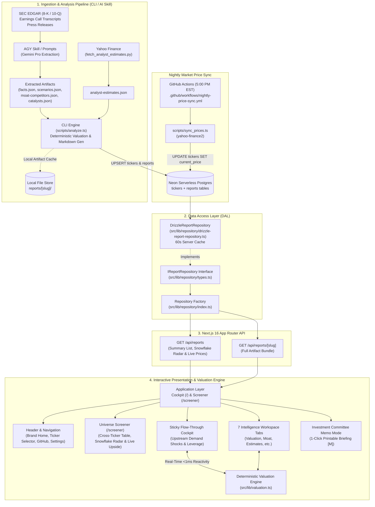

# StressAlpha — System Architecture Documentation (Current State)

> **Document Version:** 1.0.0  
> **Status:** Active / Production Baseline  
> **Target Framework:** Next.js 16 (App Router), React 19, TypeScript 5.5  
> **Last Updated:** September 2026  

---

## 1. Executive Summary & Core Philosophy

**StressAlpha** is an institutional equity earnings analysis and deterministic scenario stress-testing platform. It bridges the gap between raw corporate financial filings (SEC 10-Q/8-K, earnings call transcripts) and real-time investment committee decision-making.

### Architectural Tenets
1. **Deterministic Arithmetic Over LLM Hallucination:** Large Language Models are used exclusively for qualitative and forensic **fact extraction** (including corporate governance and accounting audit flags). All financial modeling, operating leverage flows, regime probability distributions (via the Quantitative Probability Calibration Engine), valuation bands, and risk asymmetry skews are computed via pure TypeScript arithmetic with zero non-deterministic drift.
2. **Strict Zod Contract Validation:** Every piece of incoming data is validated against strongly-typed Zod schemas (`src/lib/schemas.ts`). Malformed inputs fail fast before reaching the valuation engine or presentation layer.
3. **Sub-Millisecond Client-Side Simulation:** Once a report payload is loaded into the browser, all sensitivity sliders (Hyperscaler CapEx shocks, gross margin shifts, fixed OpEx elasticity) execute client-side at `<1ms` latency without round-trip network overhead.
4. **Decoupled Data Access Layer (DAL):** The system isolates presentation and routing from storage behind an explicit repository interface (`IReportRepository`), enabling seamless transitions between local filesystem storage and cloud databases.

---

## 2. High-Level Architecture Diagram



---

## 3. Directory & Module Structure

```
stress-alpha/
├── .github/workflows/
│   ├── ci.yml                          # GitHub Actions CI workflow
│   └── nightly-price-sync.yml          # Automated 5:00 PM EST market price sync
├── drizzle.config.ts                   # Drizzle ORM configuration for PostgreSQL
├── docs/                               # System specifications and architectural blueprints
│   ├── architecture.md
│   ├── spec-neon-drizzle.md
│   ├── spec-multi-quarter-earnings.md
│   └── images/                         # UI preview screenshots
├── prompts/                            # Multi-stage LLM extraction prompt templates
│   ├── stage1-facts.md
│   ├── stage1b-moat.md
│   ├── stage2-sentiment.md
│   ├── stage3-scenarios.md
│   └── stage4-audit.md
├── scripts/                            # Automation & CLI engines
│   ├── analyze.ts                      # Valuation arithmetic, markdown gen & DB persistence
│   ├── sync_prices.ts                  # Nightly Yahoo Finance live market price sync
│   ├── migrate_to_neon.ts              # Seeder importing reports/ into Neon DB
│   ├── fetch_analyst_estimates.py      # Consensus estimates scraper
│   ├── run_flow.sh                     # Full pipeline orchestration script
│   ├── open_report.sh                  # Quick browser launcher
│   └── capture_screenshots.sh          # Headless screenshot generator
├── src/
│   ├── app/                            # Next.js 16 App Router
│   │   ├── layout.tsx                  # Root layout with fonts & metadata
│   │   ├── page.tsx                    # Core dashboard orchestrator
│   │   ├── globals.css                 # Dark theme & styling primitives
│   │   ├── methodology/page.tsx        # Interactive formula guide & documentation
│   │   └── api/reports/
│   │       ├── route.ts                # GET /api/reports
│   │       └── [slug]/route.ts         # GET /api/reports/[slug]
│   ├── components/                     # React 19 UI Components
│   │   ├── Header.tsx                  # Top nav, ticker switcher, price display
│   │   ├── Cockpit.tsx                 # Sticky left flow-through simulator
│   │   ├── ScreenerView.tsx            # Cross-ticker universe comparison table
│   │   ├── PriceMeter.tsx              # Dynamic regime gauge (Panic <-> Bull)
│   │   ├── MemoView.tsx                # Investment committee memorandum
│   │   ├── ReportSelector.tsx          # Dropdown dataset selector
│   │   └── tabs/                       # Focused analysis workspaces
│   │       ├── ScenariosTab.tsx        # Bull/Base/Bear scenario matrix & tree
│   │       ├── EstimatesTab.tsx        # Sell-side revisions & target tracks
│   │       ├── MoatTab.tsx             # 5-pillar moat scoring & peer matrix
│   │       ├── SegmentsTab.tsx         # Revenue velocity & guidance ranges
│   │       ├── CatalystsTab.tsx        # Catalyst weight sliders & horizons
│   │       ├── AuditTab.tsx            # SEC 10-Q disclosures & tone scorecard
│   │       └── ...
│   ├── db/                             # Neon Serverless Postgres + Drizzle ORM
│   │   ├── schema.ts                   # Tickers & reports tables with typed JSONB
│   │   └── index.ts                    # Drizzle client & connection pool
│   └── lib/                            # Core domain logic & utilities
│       ├── schemas.ts                  # Zod schemas for all 10 artifacts
│       ├── valuation.ts                # Deterministic arithmetic & shock propagation
│       ├── url-state.ts                # Bidirectional URL state sync & serialization
│       ├── report.ts                   # Bilingual markdown report renderer
│       ├── i18n.ts                     # Internationalization translation maps
│       ├── utils.ts                    # Formatting & currency helpers
│       └── repository/                 # Data Access Layer (DAL)
│           ├── types.ts                # IReportRepository & ReportSummary interfaces
│           ├── drizzle-report-repository.ts # Neon Postgres implementation with live price joins
│           ├── fs-report-repository.ts # Filesystem fallback implementation
│           ├── in-memory-report-repository.ts # Test mock repository
│           └── index.ts                # Dual-mode repository singleton factory
└── tests/                              # Vitest automated test suite (111 tests across 12 suites)
    ├── auth.test.ts                    # Better Auth endpoints & session tests
    ├── multi-quarter.test.ts           # Multi-quarter historical earnings navigation tests
    ├── report.test.ts                  # Bilingual markdown rendering tests
    ├── repository.test.ts              # Data access layer & Neon DB tests
    ├── schemas.test.ts                 # Zod validation suite
    ├── screener.test.ts                # Universe metrics & API route tests
    ├── snowflake.test.ts               # 30-point radar scoring tests
    ├── social-card.test.ts             # Social media card rendering tests
    ├── url-state.test.ts               # URL parameter state serialization tests
    ├── utils.test.ts                   # Formatting & currency helpers tests
    ├── valuation.test.ts               # Arithmetic, elasticity & QPCE calibration unit tests
    └── watchlist.test.ts               # Cloud & local watchlist persistence tests
```

---

## 4. Data Layer Architecture

### 4.1 Artifact Schema Hierarchy (`src/lib/schemas.ts`)

Data is structured as a collection of domain-specific JSON artifacts grouped inside a folder named by the report slug (`{TICKER}-{QUARTER}-{YEAR}-analysis`):

| Artifact File | Schema | Key Attributes & Purpose |
| :--- | :--- | :--- |
| `facts.json` | `FactsSchema` | Revenue, YoY growth, operating income, GAAP EPS, consensus EPS, segment breakdown, forward guidance, **one-time items**, and **governanceRisk** (`none`/`low`/`moderate`/`severe`), `accountingFlags`, `materialLitigationOrDoj`. |
| `scenarios.json` | `ScenariosSchema` | Bear, Base, Bull, and Panic regimes with `rawProbability` (prior), `calibratedProbability` (posterior), forward EPS, exit multiples, and qualitative drivers. |
| `valuation.json` | `ValuationSchema` | Precomputed weighted fair value, discount/premium, asymmetry skew, priced-in multiple, and `calibrationAudit` (QPCE audit log). |
| `stress-baseline.json` | `FinancialModelBaselineSchema` | Macro shock exposures (CapEx, Consumer, Ad spend), gross margin baselines, fixed OpEx ratios, and segment elasticities. |
| `moat-competitors.json` | `MoatCompetitorsSchema` | 5 moat pillars (0–10 scores), overall moat rating (*Wide/Narrow/None*), trend, and peer comparison matrix. |
| `analyst-estimates.json`| `AnalystEstimatesSchema` | Street consensus target (low/mean/median/high), price target revisions, and rating distributions (Buy/Hold/Sell). |
| `catalysts.json` | `CatalystsSchema` | Categorized catalysts (Product, Macro, Regulatory), directional impact, probability, horizon, and confidence. |
| `earnings-sentiment.json`| `EarningsSentimentSchema` | Management tone scorecard, sentiment shifts vs prior quarters, and direct guidance quotes. |
| `filing-extracts.json` | `FilingExtractsSchema` | SEC 10-Q risk disclosures, legal proceedings, and accounting changes. |
| `reactions.json` | `ReactionsSchema` | Historical post-earnings stock reactions (1-day, 1-week, 1-month). |

### 4.2 The Income Quality Guardrail
StressAlpha explicitly isolates non-operating accounting anomalies in `facts.json`. For example:
- **ASU 2016-01 Normalization:** Strips mark-to-market equity investment paper gains (e.g. Amazon's $53.4B Anthropic valuation mark in Q2 2026) out of Reported Diluted EPS to yield **Operating EPS**.
- The valuation engine defaults to operating earnings to prevent artificial multiple depression.

### 4.3 Data Access Layer (DAL) Pattern

To avoid coupling the Next.js frontend or API routes directly to `fs`, the system uses an explicit interface:

```typescript
// src/lib/repository/types.ts
export interface IReportRepository {
  listReports(): Promise<ReportSummary[]>;
  getReport(slug: string): Promise<ReportData | null>;
  hasReport(slug: string): Promise<boolean>;
}
```

* **`DrizzleReportRepository` (`src/lib/repository/drizzle-report-repository.ts`):** 
  Directly queries Neon Serverless PostgreSQL (`reportsTable` left-joined with `tickersTable`), hydrates facts, scenarios, valuations, and markdown artifacts, and maintains an in-memory cache with a 60-second TTL to deliver sub-5ms API response times.
* **`InMemoryReportRepository` (`src/lib/repository/in-memory-report-repository.ts`):** 
  Enables fast, isolated unit testing without touching database connections.
* **Factory Singleton (`src/lib/repository/index.ts`):** 
  Exposes `getReportRepository()` (instantiating `DrizzleReportRepository`) and `setReportRepository()`.

---

## 5. Computational Valuation Engine (`src/lib/valuation.ts`)

The arithmetic engine runs identically in two execution contexts:
1. **Offline / CLI:** Executed inside `scripts/analyze.ts` during report compilation.
2. **Online / Client Browser:** Executed inside `src/components/Cockpit.tsx` whenever a user adjusts a sensitivity slider.

### 5.1 Sensitivity Shock Propagation Equations

When upstream macro sliders are perturbed, shocks propagate into the company's financial statement:

1. **Top-Line Demand Shock:**
   $$\Delta \text{Revenue} = \text{Base Revenue} \times \sum_{i} \left( \text{Exposure}_i \times \text{Elasticity}_i \times \text{Shock}_i \right)$$
   Where $i \in \{\text{Hyperscaler CapEx}, \text{Consumer Demand}, \text{Digital Ad Spend}\}$.

2. **Operating Leverage & Operating Margin:**
   $$\text{Stressed Gross Profit} = \text{Stressed Revenue} \times (\text{Gross Margin}_{\text{base}} + \Delta \text{Margin}_{\text{bps}})$$
   $$\text{Stressed OpEx} = \text{Fixed OpEx}_{\text{base}} \times (1 + \Delta \text{FixedOpEx}_{\%}) + \text{Variable OpEx}$$
   $$\text{Stressed Operating Income} = \text{Stressed Gross Profit} - \text{Stressed OpEx}$$

3. **Stressed Diluted EPS:**
   $$\text{Stressed EPS} = \frac{\text{Stressed Net Income}}{\text{Diluted Shares Outstanding}}$$

4. **Risk / Reward Asymmetry Skew:**
   $$\text{Asymmetry Skew} = \frac{\text{Bull Fair Value} - \text{Current Price}}{\text{Current Price} - \text{Panic Fair Value}}$$
   - Skew $> 2.0$: Highly favorable risk/reward (deep discount to regime boundaries).
   - Skew $< 0.8$: Asymmetric downside risk.

### 5.2 Quantitative Probability Calibration Engine (QPCE)

To eliminate naive symmetrical priors (e.g., universal 25% Bull / 50% Base / 25% Panic) and prevent distorted valuations (such as assigning high upside to governance-distressed equities like SMCI), StressAlpha incorporates a deterministic **Quantitative Probability Calibration Engine (QPCE)** in [`src/lib/valuation.ts`](file:///Users/krding/Projects/stress-alpha/src/lib/valuation.ts):

#### Mathematical Log-Odds Softmax Formulation
1. **Log-Odds Transformation:**
   $$z_i = \ln(p_i) \quad \text{for } i \in \{\text{Bull}, \text{Base}, \text{Bear}, \text{Panic}\}$$
2. **Deterministic Perturbation:**
   $$z_i' = z_i + \Delta z_i^{\text{gov}} + \Delta z_i^{\text{margin}} + \Delta z_i^{\text{consensus}} + \Delta z_i^{\text{mkt}}$$
3. **Temperature-Controlled Softmax ($T = 1.0$):**
   $$p_i' = \frac{\exp(z_i' / T)}{\sum_{j} \exp(z_j' / T)}$$
4. **Simplex Contraction & Bounding ($\epsilon = 0.05$):**
   $$p_i \in [\epsilon, 1 - \epsilon] \quad \text{with} \quad \sum_{i} p_i \equiv 1.000$$

#### The 4 Institutional Calibration Pillars
1. **Forensic & Governance Veto (Pillar 1):**
   - **Severe Risk / Accounting Flags / DOJ Scrutiny:** Applies a non-linear $+1.8$ logit penalty to Panic and $-1.2$ to Bull. Imposes a strict **Lexicographic Veto**: Panic probability is floored at $\ge 45\%$, Bull probability is capped at $\le 8\%$, and gross margin resilience cushions are disabled (the *Wirecard/Enron guardrail*).
   - **Moderate Governance Risk:** Applies $+0.8$ to Panic and $-0.4$ to Bull.
2. **Archetype-Aware Resilience & Capital Runway (Pillar 2):**
   - **Archetype Classification:** Equities are categorized into 3 valuation archetypes with deterministic invariant gating:
     - `compounder` (Archetype A): Mature cash cows (e.g. AAPL, CSCO, MSFT, COST). Operating margin $>30\%$ adds $+0.3$ Bull / $-0.4$ Panic. Operating margin $<15\%$ applies $-0.3$ Bull / $+0.5$ Panic, with the **Costco Compounder Exemption** waiving penalties for Wide Moat companies with $\ge 10$ years durability.
     - `operating_scaler` (Archetype B): Operating leverage scalers (e.g. RDDT, NOW, PLTR) with revenue growth $\ge 25\%$ and gross margins $\ge 60\%$. High or inflecting operating margins reward operating leverage velocity ($+0.3$ Bull / $-0.35$ Panic).
     - `venture_hypergrowth` (Archetype C): Scale-up innovators (e.g. ONDS) with revenue growth $\ge 50\%$ and negative operating margin.
       - **Unit Economics Exemption:** Mandatory gross margin floor ($\ge 35\%$). If satisfied, waives negative operating margin penalties ($+0.1$ Bull / $-0.1$ Panic) as growth reinvestment. If failed ($<35\%$), triggers broken-unit-economics penalty ($-0.5$ Bull / $+0.6$ Panic).
       - **Net Liquid Runway & Dilution Overhang:** Audits net cash runway $\tau_{\text{net}} = (\text{cash} - \text{short-term debt}) / \text{monthly burn}$:
         - $\tau_{\text{net}} < 9$ months: Acute dilution penalty ($\Delta z_{\text{panic}} = +1.25, \Delta z_{\text{bull}} = -1.10$), pricing in emergency secondary equity dilution.
         - $9 \le \tau_{\text{net}} < 18$ months: Moderate dilution overhang ($\Delta z_{\text{panic}} = +0.50, \Delta z_{\text{bull}} = -0.35$).
         - $\tau_{\text{net}} \ge 18$ months: Abundant runway ($\Delta z_{\text{bull}} = +0.15$).
   - **Moat Trend Adjustment:** Widening moats add $+0.2$ to $+0.25$ Bull / $-0.2$ to $-0.25$ Panic; narrowing moats add $-0.25$ to $-0.35$ Bull / $+0.3$ to $+0.4$ Panic.
3. **Sell-Side Consensus Skew & Dispersion (Pillar 3):**
   - Ingests consensus buy/hold/sell distributions and price target dispersion $(\text{High} - \text{Low}) / \text{Mean}$ from `analyst-estimates.json`.
   - Strong consensus conviction ($>70\%$ Buy) shifts $+0.4$ Bull / $-0.3$ Panic; elevated dispersion ($>0.60$) widens tail probabilities (+0.2 Bull, +0.2 Panic).
4. **Market-Price Bayesian Shrinkage Anchor (Pillar 4):**
   - Solves for the market-implied disaster probability $P_{\text{mkt, panic}}$ from current trading price.
   - Applies an empirical Bayesian shrinkage anchor ($w_{\text{mkt}} = 0.20$) to ground scenarios in market reality without eliminating fundamental mispricing discovery.

---

## 6. Frontend Architecture & State Management

### 6.1 State Flow & URL Synchronization
State is partitioned cleanly between **server-fetched data** and **ephemeral interactive exploration**:

```
                  ┌───────────────────────────────┐
                  │       Server Data Fetch       │
                  │ (GET /api/reports/[slug])     │
                  └───────────────┬───────────────┘
                                  │
                                  ▼
┌─────────────────────────────────────────────────────────────────┐
│ React 19 State Container (src/app/page.tsx)                     │
│                                                                 │
│  - activeReportData: ReportData (Facts, Scenarios, Moat, etc.)  │
│  - mode: 'cockpit' | 'screener' | 'memo'                        │
│  - activeTab: string (0 through 6)                              │
│  - customParameters: Scenario tree overrides (P/E, EPS)         │
│  - sliderValues: Upstream shock perturbations                   │
└────────────────┬───────────────────────────────┬────────────────┘
                 │                               │
                 ▼                               ▼
  ┌──────────────────────────────┐ ┌──────────────────────────────┐
  │   Deterministic Simulator    │ │  Bidirectional URL Sync      │
  │   (computeValuation())       │ │  (src/lib/url-state.ts)      │
  │   Response time: < 1ms       │ │  Deep links: ?report=...&    │
  │                              │ │  mode=...&tab=...&shocks=... │
  └──────────────────────────────┘ └──────────────────────────────┘
```

### 6.2 Key UI Components
* **`ScreenerView.tsx`:** Multi-ticker radar table with visual spread bars ($\text{Bear} \leftrightarrow \text{Price} \leftrightarrow \text{Base} \leftrightarrow \text{Bull}$), moat badges, and 1-click navigation.
* **`Cockpit.tsx`:** Left-hand sticky control station featuring the **Live P&L Strip**, **Price Range Meter**, upstream sensitivity sliders, and margin levers.
* **`MemoView.tsx`:** Publication-ready 1-page investment committee memo toggled via hotkey `[M]` or button, formatted for print and PDF export.
* **`Header.tsx`:** Navigation bar with dataset selector, current stock price, upside percentage, language switcher (EN / 中文), and link to `/methodology`.

---

## 7. Analysis & Ingestion Pipeline

The pipeline currently runs via the CLI and the AGY skill:

```
                  ┌──────────────────────────────┐
                  │ 1. SEC Filings & Transcripts │
                  └──────────────┬───────────────┘
                                 │
                                 ▼
                  ┌──────────────────────────────┐
                  │ 2. AI Skill Multi-Stage      │
                  │    Extraction (Gemini Pro)   │
                  │    - Stage 1: Facts          │
                  │    - Stage 1b: Moat & Peers  │
                  │    - Stage 2: Sentiment      │
                  │    - Stage 3: Scenarios      │
                  │    - Stage 4: SEC Audit      │
                  └──────────────┬───────────────┘
                                 │
                                 ▼
                  ┌──────────────────────────────┐
                  │ 3. Yahoo Finance Scraper     │
                  │    (fetch_analyst_estimates) │
                  └──────────────┬───────────────┘
                                 │
                                 ▼
                  ┌──────────────────────────────┐
                  │ 4. Deterministic Engine      │
                  │    (scripts/analyze.ts)      │
                  │    - Valuation calculations  │
                  │    - Zod schema validation   │
                  │    - Bilingual markdown gen  │
                  └──────────────┬───────────────┘
                                 │
                                 ▼
                  ┌──────────────────────────────┐
                  │ 5. Local Artifact Store      │
                  │    reports/{slug}/*.json     │
                  └──────────────────────────────┘
```

---

## 8. Database Architecture & Server-Side Caching

The platform implements a production-grade **Neon Serverless PostgreSQL** backend managed via **Drizzle ORM** with in-memory server caching:

| Dimension | Specification |
| :--- | :--- |
| **Storage Medium** | Neon Serverless Postgres (`tickers`, `reports` tables with JSONB schemas) |
| **Data Access Layer** | `DrizzleReportRepository` with 60s TTL server cache and client-side memory cache |
| **Market Pricing** | Live market prices synced nightly via GitHub Actions |
| **Valuation Upside %** | Dynamically recalculated in-memory against latest market close |
| **AI Skill Persistence** | Autonomous pipeline upserts directly into Neon DB |

### The Data Access Layer Contract
All data access in Next.js routes (`/api/reports`, `/api/reports/[slug]`) and server pages is routed through:
1. `getReportRepository().listReports()` in [`src/app/api/reports/route.ts`](file:///Users/krding/Projects/stress-alpha/src/app/api/reports/route.ts)
2. `getReportRepository().getReport(slug)` in [`src/app/api/reports/[slug]/route.ts`](file:///Users/krding/Projects/stress-alpha/src/app/api/reports/%5Bslug%5D/route.ts)

`getReportRepository()` instantiates `DrizzleReportRepository`, joining reports with live ticker quotes. With in-memory server caching (60s TTL) and client-side parallel fetching (`Promise.all`), navigation between reports and the screener resolves in under 5ms.
