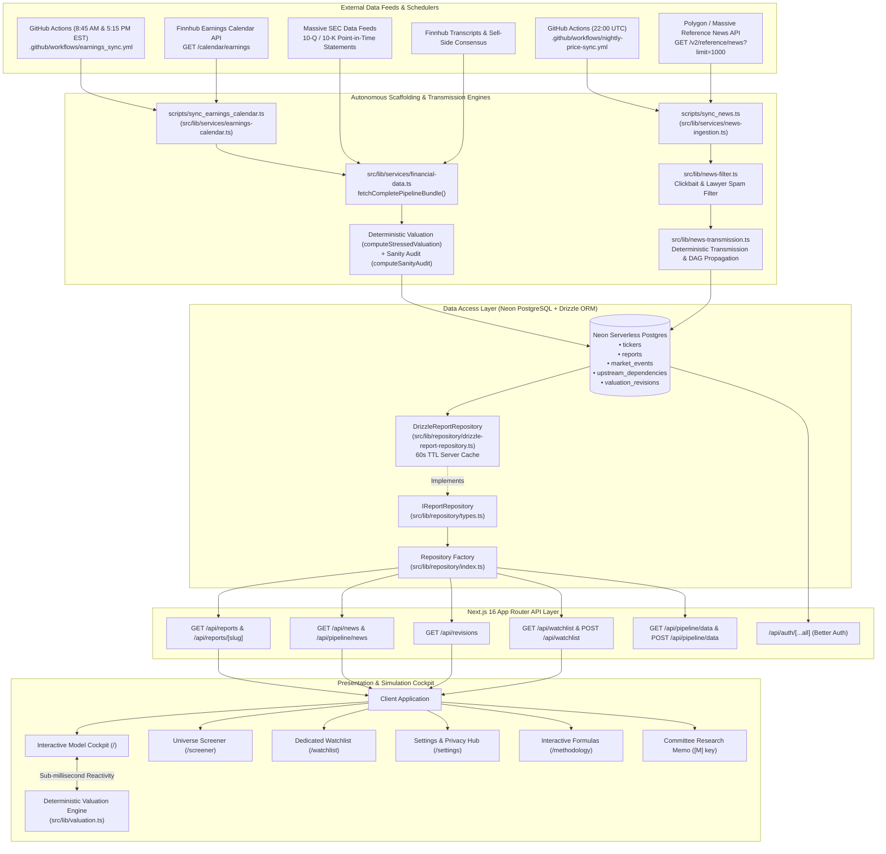
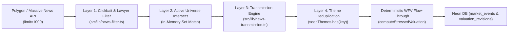

# StressAlpha — System Architecture Documentation

> **Document Version:** 1.2.0  
> **Status:** Active / Production Baseline  
> **Target Framework:** Next.js 16 (App Router), React 19, TypeScript 5.5  
> **Last Updated:** October 2026  

---

## 1. Executive Summary & Core Philosophy

**StressAlpha** is an institutional equity earnings analysis and deterministic scenario stress-testing platform. It bridges the gap between raw corporate financial filings (SEC 10-Q/8-K, earnings call transcripts) and real-time investment committee decision-making.

### Architectural Tenets
1. **Zero LLM Math Hallucinations**: Large Language Models are used exclusively for qualitative context extraction and forensic auditing (e.g. governance flags, accounting risk excerpts). All financial arithmetic, operating leverage flows, regime probability distributions (via QPCE), valuation bands, and risk asymmetry skews are computed by pure deterministic TypeScript engines (`src/lib/valuation.ts`, `src/lib/snowflake.ts`).
2. **Audited SEC Data Extraction & Financial Feeds**: Extract facts directly from SEC 10-K / 10-Q filings, press releases, and earnings call transcripts via **Massive.com** (point-in-time statements and ratios) and **Finnhub.io** (audio transcripts, SEC filings, consensus targets, and earnings calendar).
3. **Event-Driven Fundamental Transmission**: Real-time market news and corporate announcements are filtered for clickbait and legal solicitations, then converted into typed fundamental transmission vectors (driver shocks, segment growth, consensus skews) that flow deterministically into valuation models without AI price speculation.
4. **Autonomous Earnings Calendar Scaffolding**: An inverted daily polling model queries Finnhub's earnings calendar twice daily (post-BMO and post-AMC), auto-scaffolding complete bilingual 8-module report models, computing valuations, and logging sanity audits into Neon PostgreSQL.
5. **Strict Zod Contract Validation**: Every piece of incoming data is validated against strongly-typed Zod schemas (`src/lib/schemas.ts`). Malformed inputs fail fast before reaching the valuation engine or presentation layer.
6. **Sub-Millisecond Client-Side Simulation**: Once a report payload is loaded into the browser, all sensitivity sliders (upstream demand shocks, gross margin shifts, fixed OpEx elasticity) execute client-side at `<1ms` latency without round-trip network overhead.
7. **Isolated Ephemeral Integration Testing**: Vitest integration tests run against copy-on-write database branches spun up from production Neon PostgreSQL in ~0.88s, providing 100% cloud parity without polluting production data.

---

## 2. High-Level Architecture Diagram


```mermaid
flowchart TB
    subgraph DataSources["External Data Feeds & Schedulers"]
        FinnhubCal["Finnhub Earnings Calendar API\nGET /calendar/earnings"]
        PolygonNews["Polygon / Massive Reference News API\nGET /v2/reference/news?limit=1000"]
        MassiveSEC["Massive SEC Data Feeds\n10-Q / 10-K Point-in-Time Statements"]
        FinnhubTranscripts["Finnhub Transcripts & Sell-Side Consensus"]
        CronEarnings["GitHub Actions (8:45 AM & 5:15 PM EST)\n.github/workflows/earnings_sync.yml"]
        CronNightly["GitHub Actions (22:00 UTC)\n.github/workflows/nightly-price-sync.yml"]
    end

    subgraph AutonomousEngines["Autonomous Scaffolding & Transmission Engines"]
        CronEarnings --> IngestCal["scripts/sync_earnings_calendar.ts\n(src/lib/services/earnings-calendar.ts)"]
        FinnhubCal --> IngestCal
        IngestCal --> Scaffolder["src/lib/services/financial-data.ts\nfetchCompletePipelineBundle()"]
        MassiveSEC & FinnhubTranscripts --> Scaffolder
        Scaffolder --> EvalPipeline["Deterministic Valuation (computeStressedValuation)\n+ Sanity Audit (computeSanityAudit)"]

        CronNightly --> IngestNews["scripts/sync_news.ts\n(src/lib/services/news-ingestion.ts)"]
        PolygonNews --> IngestNews
        IngestNews --> NewsFilter["src/lib/news-filter.ts\nClickbait & Lawyer Spam Filter"]
        NewsFilter --> NewsTransmission["src/lib/news-transmission.ts\nDeterministic Transmission & DAG Propagation"]
    end

    subgraph StorageLayer["Data Access Layer (Neon PostgreSQL + Drizzle ORM)"]
        EvalPipeline --> NeonDB[("Neon Serverless Postgres\n• tickers\n• reports\n• market_events\n• upstream_dependencies\n• valuation_revisions")]
        NewsTransmission --> NeonDB
        
        NeonDB --> DAL["DrizzleReportRepository\n(src/lib/repository/drizzle-report-repository.ts)\n60s TTL Server Cache"]
        DAL -.->|"Implements"| IRepo["IReportRepository\n(src/lib/repository/types.ts)"]
        IRepo --> Factory["Repository Factory\n(src/lib/repository/index.ts)"]
    end

    subgraph APILayer["Next.js 16 App Router API Layer"]
        Factory --> APIReports["GET /api/reports & /api/reports/[slug]"]
        Factory --> APINews["GET /api/news & /api/pipeline/news"]
        Factory --> APIRevisions["GET /api/revisions"]
        Factory --> APIWatchlist["GET /api/watchlist & POST /api/watchlist"]
        Factory --> APIPipeline["GET /api/pipeline/data & POST /api/pipeline/data"]
        NeonDB --> APIAuth["/api/auth/[...all] (Better Auth)"]
    end

    subgraph PresentationLayer["Presentation & Simulation Cockpit"]
        APIReports & APINews & APIRevisions & APIWatchlist --> ClientPages["Client Application"]
        ClientPages --> Dashboard["Interactive Model Cockpit (/)"]
        ClientPages --> Screener["Universe Screener (/screener)"]
        ClientPages --> Watchlist["Dedicated Watchlist (/watchlist)"]
        ClientPages --> Settings["Settings & Privacy Hub (/settings)"]
        ClientPages --> Methodology["Interactive Formulas (/methodology)"]
        ClientPages --> Memo["Committee Research Memo ([M] key)"]

        Dashboard <-->|"Sub-millisecond Reactivity"| ValEngine["Deterministic Valuation Engine\n(src/lib/valuation.ts)"]
    end
```

---

## 3. Directory & Module Structure

```
stress-alpha/
├── .github/workflows/
│   ├── ci.yml                          # GitHub Actions CI workflow (format, lint, tsc, test, build)
│   ├── nightly-price-sync.yml          # Automated 22:00 UTC market price & news sync
│   └── earnings_sync.yml               # Twice-daily automated earnings sync & scaffolding (BMO & AMC)
├── drizzle.config.ts                   # Drizzle ORM configuration for PostgreSQL
├── docs/                               # System specifications and architectural blueprints
│   ├── architecture.md                 # System architecture documentation
│   ├── spec-neon-drizzle.md            # Neon Postgres + Drizzle ORM technical spec
│   ├── spec-multi-quarter-earnings.md  # Multi-quarter historical earnings specification
│   └── images/                         # UI preview screenshots
├── scripts/                            # Standalone CLI engines & workflows
│   ├── sync_earnings_calendar.ts       # Finnhub earnings calendar ingestion & scaffolding
│   ├── sync_news.ts                    # Polygon firehose news ingestion & transmission calculation
│   ├── sync_prices.ts                  # Market price synchronization (Yahoo Finance)
│   ├── fetch_data.ts                   # SEC 10-Q & consensus pipeline data extractor
│   ├── seed_upstream_dependencies.ts   # Supply chain cross-company DAG seeder
│   └── analyze.ts                      # CLI valuation & report persistence engine
├── src/
│   ├── app/                            # Next.js 16 App Router
│   │   ├── layout.tsx                  # Root layout with fonts, theme script, and metadata
│   │   ├── page.tsx                    # Core dashboard orchestrator (Model + Intelligence Tabs)
│   │   ├── screener/                   # Standalone universe screener page (/screener)
│   │   ├── watchlist/                  # Standalone tracked watchlist page (/watchlist)
│   │   ├── settings/                   # Standalone settings & institutional privacy hub (/settings)
│   │   ├── methodology/page.tsx        # Interactive mathematical formula guide (/methodology)
│   │   ├── globals.css                 # FactSet/WSJ Light and Bloomberg Dark styling primitives
│   │   └── api/                        # REST API endpoints
│   │       ├── auth/[...all]/          # Better Auth endpoints
│   │       ├── news/                   # Market events retrieval
│   │       ├── pipeline/               # Data and news scaffolding triggers
│   │       ├── reports/                # Report summaries and full artifact bundles
│   │       ├── revisions/              # Valuation revision history ledger
│   │       └── watchlist/              # Hybrid cloud watchlist persistence
│   ├── components/                     # React 19 UI components
│   │   ├── Header.tsx                  # Top nav bar, brand home, mode switcher, theme toggle
│   │   ├── Cockpit.tsx                 # Sticky flow-through simulator & sensitivity sliders
│   │   ├── ScreenerView.tsx            # Multi-ticker radar table & adaptive cards
│   │   ├── WatchlistView.tsx           # Tracked portfolio telemetry strip & multi-quarter groups
│   │   ├── PriceMeter.tsx              # Dynamic regime gauge (Panic <-> Bull)
│   │   ├── MemoView.tsx                # Publication-ready 1-page investment committee memo
│   │   ├── ReportSelector.tsx          # Unified ticker and quarter capsule
│   │   ├── snowflake/                  # 30-Point Snowflake fundamental radar chart & modal
│   │   ├── social-card/                # High-res social export card generator
│   │   └── tabs/                       # 8 Specialized intelligence workspaces
│   │       ├── ScenariosTab.tsx        # Valuation matrix & immutable revision ledger
│   │       ├── EstimatesTab.tsx        # Sell-side consensus revisions & target tracks
│   │       ├── MoatTab.tsx             # 5-pillar moat evaluation & competitor benchmarking
│   │       ├── SegmentsTab.tsx         # Revenue breakdown velocity & forward guidance
│   │       ├── CatalystsTab.tsx        # Catalyst weight sliders & horizons
│   │       ├── NewsTab.tsx             # Real-time market pulse & event simulation triggers
│   │       ├── AuditTab.tsx            # SEC 10-Q disclosures & tone scorecard
│   │       └── ReactionsTab.tsx        # Historical post-earnings stock reactions
│   ├── context/
│   │   └── ThemeContext.tsx            # Dual-theme provider (Dark Bloomberg / Light WSJ)
│   ├── db/                             # Neon Serverless Postgres + Drizzle ORM
│   │   ├── schema.ts                   # Typed database schema (tickers, reports, events, revisions)
│   │   └── index.ts                    # Drizzle connection client & pooling
│   └── lib/                            # Core domain logic
│       ├── schemas.ts                  # Zod schemas for all modules and pipeline bundles
│       ├── valuation.ts                # Deterministic arithmetic, sensitivity & QPCE calibration
│       ├── snowflake.ts                # 30-point 5-pillar fundamental radar scorer
│       ├── sanity.ts                   # Variant perception & data completeness audit
│       ├── news-filter.ts              # Clickbait & class-action lawsuit spam filter
│       ├── news-transmission.ts        # Qualitative event to quantitative valuation flow
│       ├── url-state.ts                # Bidirectional URL search param serialization
│       ├── report.ts                   # Bilingual markdown report renderer
│       ├── i18n.ts                     # Centralized internationalization dictionary (EN & 中文)
│       ├── services/                   # High-level services
│       │   ├── earnings-calendar.ts    # Calendar ingestion & autonomous scaffolding
│       │   ├── financial-data.ts       # Unified financial statement & consensus pipeline
│       │   └── news-ingestion.ts       # Polygon global news firehose ingestion
│       └── repository/                 # Data Access Layer (DAL)
│           ├── types.ts                # IReportRepository interface
│           ├── drizzle-report-repository.ts # Neon Postgres implementation with 60s cache
│           ├── in-memory-report-repository.ts # In-memory mock repository for tests
│           └── index.ts                # Factory singleton
└── tests/                              # Vitest automated test suite (205 tests across 20 suites)
    ├── auth.test.ts                    # Better Auth endpoints & session tests
    ├── earnings-calendar.test.ts       # Inverted calendar parsing, session gating & scaffolding tests
    ├── financial-data.test.ts          # SEC statements, consensus targets & bundle staging tests
    ├── helpers/neon-branch.ts          # Ephemeral Neon database branch manager
    ├── multi-quarter.test.ts           # Multi-quarter historical earnings navigation tests
    ├── news-pipeline.test.ts           # News firehose, clickbait filter & transmission tests
    ├── news-ui.test.ts                 # NewsTab UI & simulation trigger tests
    ├── repository.test.ts              # Neon database repository & revision ledger tests
    ├── sanity.test.ts                  # Variant perception & data completeness tests
    ├── schemas.test.ts                 # Zod validation schema tests
    ├── screener.test.ts                # Universe screener API & upside sorting tests
    ├── settings.test.ts                # Dedicated settings hub & email privacy tests
    ├── setup/neon-branch-global.ts     # Global Vitest lifecycle for Neon test branches
    ├── snowflake.test.ts               # 30-point radar scoring tests
    ├── social-card.test.ts             # Social media card rendering tests
    ├── theme.test.ts                   # Dual-theme engine tests
    ├── url-state.test.ts               # URL parameter state serialization tests
    ├── utils.test.ts                   # Formatting & currency helpers tests
    ├── valuation.test.ts               # Arithmetic, elasticity & QPCE calibration tests
    └── watchlist.test.ts               # Cloud & local watchlist persistence tests
```

---

## 4. Data Layer Architecture

### 4.1 Neon PostgreSQL Schema (`src/db/schema.ts`)

The database architecture consists of five core domain tables and four authentication tables:

| Table | Purpose & Key Fields |
| :--- | :--- |
| `tickers` | Master equity universe. Ticker, company name, exchange, sector, live `currentPrice`, `marketCapBillions`, and `lastPriceSync`. |
| `reports` | 8-module quarterly analysis bundles. Ticker, quarter slug (`nvda-2027q1`), `reportDate`, and JSONB columns for `facts`, `scenarios`, `valuation`, `baseline`, `moat`, `estimates`, `catalysts`, `sentiment`, `filings`, and `reactions`. |
| `market_events` | Ingested and filtered market events. Ticker, headline, source URL, event category (`earnings_guidance`, `supply_chain`, `capex_driver`, `regulatory`), abnormal return, and mapped transmission vector. |
| `upstream_dependencies` | Directed supply chain graph. `sourceTicker` (e.g. `TSM`), `targetTicker` (e.g. `NVDA`), dependency type, and elasticity weight. |
| `valuation_revisions` | Immutable valuation audit trail. Ticker, trigger type (`quarterly_filing`, `market_event`, `manual_audit`), prior WFV, new WFV, delta percentage, and rationale. |
| `users`, `sessions`, `accounts`, `verifications` | Better Auth authentication and session management. |

### 4.2 The Income Quality Guardrail
StressAlpha isolates non-operating accounting anomalies in `facts.json` to compute normalized **Operating EPS**:
- **ASU 2016-01 Normalization**: Mark-to-market unrealized paper gains on equity securities (e.g. Amazon's $53.4B Anthropic valuation mark in Q2 2026) are stripped out of Reported Diluted EPS.
- The deterministic valuation engine strictly defaults to operating earnings to prevent artificial multiple distortion.

### 4.3 Data Access Layer (DAL) Pattern
All data access in Next.js routes and scripts is mediated through `IReportRepository`:

```typescript
export interface IReportRepository {
  listReports(): Promise<ReportSummary[]>;
  getReport(folderSlug: string): Promise<ReportData | null>;
  saveReport(report: ReportData): Promise<void>;
  deleteReport(folderSlug: string): Promise<void>;
  syncPrice(ticker: string, price: number): Promise<void>;
  getMarketEvents(ticker: string, limit?: number): Promise<MarketEventRecord[]>;
  saveMarketEvent(event: NewMarketEvent): Promise<void>;
  getValuationRevisions(ticker: string): Promise<ValuationRevisionRecord[]>;
  recordValuationRevision(revision: NewValuationRevision): Promise<void>;
}
```

* **`DrizzleReportRepository`**: Connected directly to Neon Serverless PostgreSQL with a 60-second in-memory server cache and client-side memory caching, delivering <5ms response times.
* **`InMemoryReportRepository`**: Complete mock implementation for fast, fully isolated unit testing without external database dependencies.

---

## 5. Computational Valuation Engine (`src/lib/valuation.ts`)

The arithmetic engine runs identically in two contexts:
1. **Server / CLI**: Executed during report compilation and autonomous earnings calendar scaffolding.
2. **Client Browser**: Executed inside `src/components/Cockpit.tsx` whenever a user adjusts a sensitivity slider (<1ms response time).

### 5.1 Sensitivity Shock Propagation Equations

1. **Top-Line Demand Shock**:
   $$\Delta \text{Revenue} = \text{Base Revenue} \times \sum_{i} \left( \text{Exposure}_i \times \text{Elasticity}_i \times \text{Shock}_i \right)$$
   Where $i \in \{\text{Hyperscaler CapEx}, \text{Consumer Demand}, \text{Digital Ad Spend}\}$.

2. **Operating Leverage & Margins**:
   $$\text{Stressed Gross Profit} = \text{Stressed Revenue} \times (\text{Gross Margin}_{\text{base}} + \Delta \text{Margin}_{\text{bps}})$$
   $$\text{Stressed OpEx} = \text{Fixed OpEx}_{\text{base}} \times (1 + \Delta \text{FixedOpEx}_{\%}) + \text{Variable OpEx}$$
   $$\text{Stressed Operating Income} = \text{Stressed Gross Profit} - \text{Stressed OpEx}$$
   $$\text{Stressed Free Cash Flow} = \text{Stressed Operating Income} \times (1 - \text{Tax Rate}) + \text{D\&A} - \text{CapEx}$$
   $$\text{FCF Conversion } \% = \frac{\text{Stressed Free Cash Flow}}{\text{Stressed Net Income}} \times 100$$
   $$\text{FCF Yield } \% = \frac{\text{FCF Per Share}}{\text{Current Price}} \times 100$$

3. **Stressed Diluted EPS**:
   $$\text{Stressed EPS} = \frac{\text{Stressed Net Income}}{\text{Diluted Shares Outstanding}}$$

4. **Risk / Reward Asymmetry Skew**:
   $$\text{Asymmetry Skew} = \frac{\text{Bull Fair Value} - \text{Current Price}}{\text{Current Price} - \text{Panic Fair Value}}$$

### 5.2 Deterministic Scenario Calibration Matrix & Archetypes

To replace naive symmetrical priors (e.g. 25/50/25) with transparent deterministic scenario probabilities, StressAlpha applies **Softmax Multi-Regime Weighting with Tail Risk Heuristics** in log-odds space:

1. **Log-Odds Transformation**: $z_i = \ln(p_i)$ for $i \in \{\text{Bull}, \text{Base}, \text{Bear}, \text{Panic}\}$.
2. **Deterministic Perturbation**: $z_i' = z_i + \Delta z_i^{\text{gov}} + \Delta z_i^{\text{archetype}} + \Delta z_i^{\text{consensus}} + \Delta z_i^{\text{mkt}}$.
3. **Softmax ($T = 1.0$)**: $p_i' = \frac{\exp(z_i')}{\sum_{j} \exp(z_j')}$.
4. **Simplex Bounding ($\epsilon = 0.05$)**: $p_i \in [0.05, 0.85]$ and $\sum_{i} p_i \equiv 1.000$.

#### The 4 Institutional Calibration Pillars
1. **Pillar 1: Forensic & Governance Tail Veto**: Severe governance risk, auditor resignations, or DOJ investigations trigger asymmetric log-odds shifts ($\Delta z_{\text{panic}} = +1.35, \Delta z_{\text{bull}} = -1.60$) and a lexicographic override capping Bull ($\le 8\%$) and flooring Panic ($\ge 45\%$), preventing high gross margins from masking accounting fraud (*Wirecard/Enron guardrail*).
2. **Pillar 2: Archetype-Aware Resilience & Capital Runway**:
   - `compounder` (Archetype A): Operating margin $>30\%$ rewarded; $<15\%$ penalized unless protected by durable Wide Moat (*Costco Compounder Exemption*).
   - `operating_scaler` (Archetype B): Fast growth ($\ge 25\%$), high gross margins ($\ge 60\%$) rewarded for operating leverage velocity.
   - `venture_hypergrowth` (Archetype C): Scale-up innovators ($\ge 50\%$ growth, negative operating margin). Must satisfy gross margin floor ($\ge 35\%$) to waive operating margin penalties (*Unit Economics Exemption*). Audits Net Liquid Runway ($\tau_{\text{net}} = (\text{cash} - \text{short-term debt}) / \text{monthly burn}$): $<9$ months triggers acute dilution penalty ($\Delta z_{\text{panic}} = +1.25, \Delta z_{\text{bull}} = -1.10$).
3. **Pillar 3: Wall Street Consensus Skew & Dispersion**: Calibrates consensus buy/hold/sell ratios and price target dispersion into tail probabilities.
4. **Pillar 4: Market-Implied Risk Anchor & Regularization**: Reverse-engineers market-priced-in disaster risk with a 20% dampening regularization weight ($w_{\text{mkt}} = 0.20$), anchoring against extreme divergence without losing fundamental alpha discovery.

> [!TIP]
> **Heuristic Framing & Empirical Calibration**: The logit adjustments represent transparent institutional heuristic bounds modeling downside tail asymmetries. For systematic production setups, these parameters can be empirically calibrated by minimizing Brier scores and log-loss against historical earnings outturns across 500+ coverage equities.

---

## 6. Event-Driven News & Transmission Pipeline


```mermaid
flowchart LR
    A["Polygon / Massive News API<br/>(limit=1000)"] --> B["Layer 1: Clickbait & Lawyer Filter<br/>(src/lib/news-filter.ts)"]
    B --> C["Layer 2: Active Universe Intersect<br/>(In-Memory Set Match)"]
    C --> D["Layer 3: Transmission Engine<br/>(src/lib/news-transmission.ts)"]
    D --> E["Layer 4: Theme Deduplication<br/>(seenThemes.has(key))"]
    E --> F["Deterministic WFV Flow-Through<br/>(computeStressedValuation)"]
    F --> G["Neon DB (market_events & valuation_revisions)"]
```

1. **Materiality & Spam Filtering (`src/lib/news-filter.ts`)**: Rejects ~90% of wire syndication spam, rhetorical questions, and class-action lawsuit solicitations with 0 LLM cost.
2. **Deterministic Transmission Engine (`src/lib/news-transmission.ts`)**: Maps qualitative events into typed quantitative vectors (`driver_shock`, `catalyst_prob`, `qpce_skew`, `segment_growth`). Pure TypeScript recalculates implied fair value delta with zero LLM math.
3. **Cross-Company DAG Propagation**: Propagates upstream announcements (e.g. ASML/TSMC wafer bookings) to downstream customers (e.g. NVIDIA revenue) via `upstream_dependencies`.

---

## 7. Inverted Earnings Calendar & Scaffolding Engine

Rather than polling 3,500 tickers individually, StressAlpha uses single-call inverted calendar polling:

1. **Calendar Query**: Ingests reporting companies for target dates via Finnhub (`GET /calendar/earnings`).
2. **Session Splitting & Timing**:
   - `bmo` (Before Market Open): Scaffolding triggered at **8:45 AM EST**.
   - `amc` (After Market Close): Scaffolding triggered at **5:15 PM EST**.
   - Timing accounts for the 5–20 minute XBRL statement normalization delay by SEC aggregators.
3. **Deduplication**: Verifies if the report already exists in Neon DB with populated statements (`revenueBillions > 0`). Skips populated reports to avoid redundant work unless forced with `--force`.
4. **Deterministic Scaffolding**: Automatically fetches point-in-time statements, price targets, guidance, and filings, scaffolding all 8 quarterly modules in both English and Chinese, running `computeStressedValuation` and `computeSanityAudit`, and appending a baseline snapshot to `valuation_revisions`.

---

## 8. Testing Strategy & Ephemeral Cloud Parity

Every commit is gated by a 5-stage verification pipeline in `.husky/pre-push` and GitHub Actions (`.github/workflows/ci.yml`):

1. **Prettier Formatting**: `npm run format:check`
2. **ESLint Linting**: `npm run lint`
3. **TypeScript Static Analysis**: `npx tsc --noEmit` (0 errors)
4. **Vitest Unit Test Suite**: `npm test` (205 tests across 20 suites)
5. **Next.js Production Build**: `npm run build` (Turbopack compilation)

### Ephemeral Neon DB Branching
Integration tests run with 100% cloud parity against isolated copy-on-write database branches spun up via the Neon API:
- `tests/setup/neon-branch-global.ts` initializes an ephemeral branch (`test-vitest-<timestamp>`) from `production` in ~0.88s.
- Repository operations execute read and write assertions against this branch.
- The ephemeral branch is deleted upon test suite completion, with automatic background reaping of any stale test branches older than 30 minutes.
