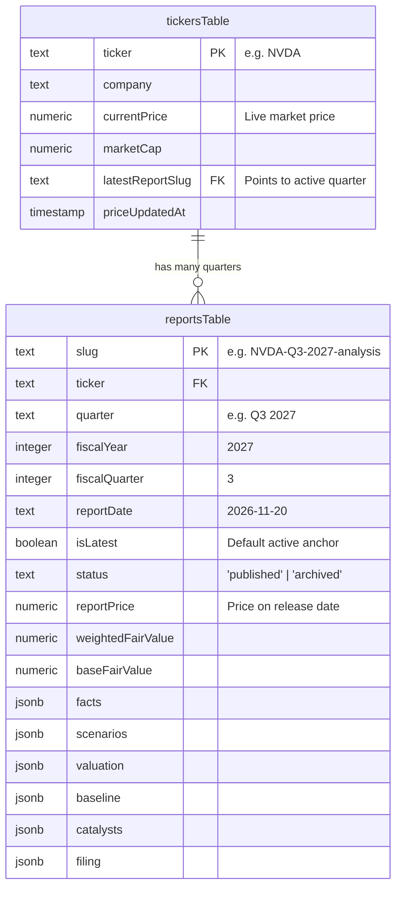
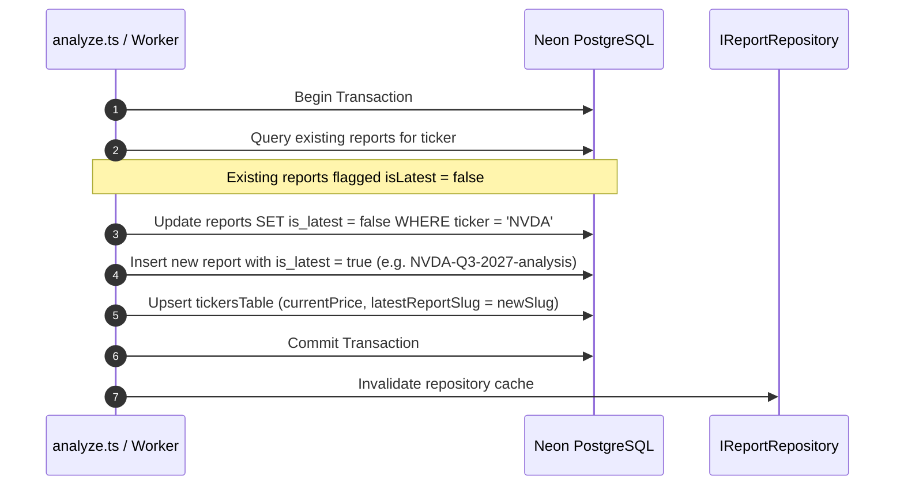
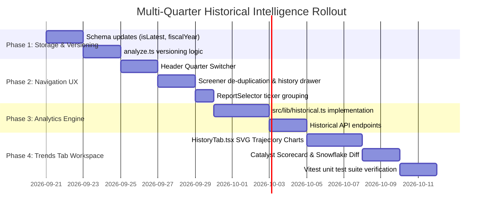

# StressAlpha: Multi-Quarter Earnings Ingestion, Historical Navigation & Longitudinal Intelligence Spec

> **Status:** Proposal & Technical Architecture Specification  
> **Author:** Antigravity + Kevin Ding  
> **Date:** September 20, 2026  
> **Target Version:** StressAlpha v1.2.0  

---

## 1. Executive Summary & Vision

StressAlpha today excels at analyzing a **single quarterly snapshot** for an equity ticker—generating deterministic 4-regime valuations, 5-pillar snowflake fundamental radars, upstream sensitivity shock trees, and SEC 10-Q qualitative audits.

However, institutional fundamental analysis is inherently **longitudinal**:
1. When a new earnings season begins and a new 10-Q/10-K is filed (e.g., NVIDIA releases Q3 2027 while Q2 2027 already exists in the system), the platform must seamlessly ingest and highlight the new report without destroying the historical record.
2. Users need to browse and inspect **past quarters** to see how the company was modeled at prior points in time.
3. Most critically, users need **aggregate cross-quarter intelligence**: Did management deliver on prior catalysts? Has operating leverage widened margins over time? Did fair value estimates predict market price reality, or did multiple compression occur?

This specification defines the complete data architecture, repository contracts, deterministic calculation engines, and institutional cockpit UI for multi-quarter earnings workflows.

---

## 2. Core Philosophy & Constraints

In alignment with [`AGENTS.md`](file:///Users/krding/Projects/stress-alpha/AGENTS.md):

1. **Zero LLM Math Hallucinations**:
   - LLMs extract qualitative context (catalyst status, 10-Q risk factor shifts, transcript tone).
   - Pure deterministic TypeScript engines (`src/lib/valuation.ts`, `src/lib/historical.ts`) calculate 100% of the cross-quarter arithmetic (CAGR, margin evolution, fair value drift, catalyst hit-rates, snowflake migration).
2. **Immutable Point-in-Time History**:
   - Past quarterly reports are historical financial documents. Their facts, assumptions, and report prices are never retroactively modified or overwritten.
3. **Institutional Cockpit Aesthetic**:
   - Fast, dense Bloomberg/FactSet-style information hierarchy using `font-mono`, `tabular-nums`, and pure SVG visualizations (zero heavy canvas or WebGL dependencies).
4. **Strict i18n Architecture**:
   - All labels, tooltips, and calculation outputs must be pre-localized via [`src/lib/i18n.ts`](file:///Users/krding/Projects/stress-alpha/src/lib/i18n.ts). Zero inline boolean ternary language checks in components.

---

## 3. Data Architecture & Schema Evolution

### 3.1 PostgreSQL Database Schema (`src/db/schema.ts`)

The database already isolates live ticker market data (`tickersTable`) from individual quarterly reports (`reportsTable`). We introduce versioning and temporal metadata to support multi-quarter hierarchies:



#### Key Schema Changes:
1. **Fiscal Ordering Columns in `reportsTable`**:
   - `fiscalYear: integer("fiscal_year").notNull()`
   - `fiscalQuarter: integer("fiscal_quarter").notNull()` (1, 2, 3, or 4)
   - `isLatest: boolean("is_latest").default(false).notNull()`
2. **Composite Indexes**:
   - `uniqueIndex("idx_reports_ticker_fq").on(table.ticker, table.fiscalYear, table.fiscalQuarter)`
   - `index("idx_reports_ticker_latest").on(table.ticker, table.isLatest)`
3. **Reference on `tickersTable`**:
   - `latestReportSlug: text("latest_report_slug").references(() => reportsTable.slug)`

---

## 4. Ingestion & Versioning Pipeline

When a new earnings report is analyzed via `scripts/analyze.ts` or the real-time automation pipeline:



### Ingestion Rules:
1. **Non-Destructive Write**: Ingesting `NVDA-Q3-2027` never deletes or alters `NVDA-Q2-2027`.
2. **Active Quarter Resolution**:
   - When a user navigates to `/` or searches `NVDA` in the screener, the system resolves `isLatest = true` by default.
   - Historical reports have `status = 'archived'` or `isLatest = false`.

---

## 5. User Experience & Navigation Workflows

### 5.1 Header Quarter Switcher (Cockpit)

In [`src/components/Header.tsx`](file:///Users/krding/Projects/stress-alpha/src/components/Header.tsx), directly next to the ticker badge:

```
┌────────────────────────────────────────────────────────────────────────┐
│ [STRESS ALPHA]  [NVDA]  [ Q3 2027 (Latest) ▾ ]  $219.73 (+56.02% WFV)  │
└──────────────────────────────┬─────────────────────────────────────────┘
                               │ (Dropdown click)
                               ▼
    ┌───────────────────────────────────────────────────────────┐
    │ 📅 Select Quarterly Report                                │
    ├───────────────────────────────────────────────────────────┤
    │  ● Q3 2027 (Latest)   2026-11-20   WFV: $330.00  (+50.2%) │
    │    Q2 2027            2026-08-26   WFV: $295.00  (+34.1%) │
    │    Q1 2027            2026-05-22   WFV: $260.00  (+18.3%) │
    │    Q4 2026            2026-02-21   WFV: $220.00  (+0.1%)  │
    ├───────────────────────────────────────────────────────────┤
    │  📈 Open Multi-Quarter Historical Trends [8]              │
    └───────────────────────────────────────────────────────────┘
```

### 5.2 Screener De-duplication & Grouping

In [`src/components/ScreenerView.tsx`](file:///Users/krding/Projects/stress-alpha/src/components/ScreenerView.tsx):
- **Default View**: Returns exactly **1 row per ticker** using its latest quarter (`isLatest === true`).
- **History Expand Pill**: Each row includes a badge: `[ 3 Quarters ]`.
- **Expansion Drawer**: Clicking the badge expands child sub-rows directly beneath the ticker, displaying historical valuation upside, operating margins, and snowflake tiers over time.

### 5.3 URL Deep Linking & Backward Compatibility

- Direct ticker entry: `/?ticker=NVDA` $\rightarrow$ Resolves to latest active quarter.
- Specific point-in-time quarter: `/?ticker=NVDA&quarter=Q2-2027` or `/?report=NVDA-Q2-2027-analysis`.
- Preserves full scenario stress params (`shocks`, `grossMarginDelta`, `fixedOpexShift`) per report.

---

## 6. Longitudinal Intelligence Engine (`src/lib/historical.ts`)

A dedicated deterministic engine consumes the array of sequential reports for a ticker:

$$\text{Series} = [R_1, R_2, \dots, R_T] \quad \text{where } t_1 < t_2 < \dots < t_T$$

It produces structured, audited longitudinal metrics:

### 6.1 Valuation & Fair Value Drift

```typescript
export interface ValuationDriftPoint {
  quarter: string;
  reportDate: string;
  reportPrice: number;
  weightedFairValue: number;
  baseFairValue: number;
  bullFairValue: number;
  panicFairValue?: number;
  marginOfSafetyPct: number; // ((WFV - reportPrice) / reportPrice) * 100
  consensusTarget?: number;
}
```
- **Corridor Analysis**: Compares whether actual stock price in period $t+1$ remained inside the modeled $[ \text{Panic Floor}_t, \text{Bull Target}_t ]$ corridor from period $t$.

### 6.2 Operating Leverage & Margin Progression

- **Clean Operating EPS Velocity**:
  $$\Delta \text{EPS}_{\text{operating}} = \frac{\text{EPS}_{t} - \text{EPS}_{t-1}}{\text{EPS}_{t-1}}$$
  Isolates pure operational performance from ASU 2016-01 mark-to-market and non-recurring one-offs.
- **Operating Leverage Verification**:
  $$\text{Operating Leverage Factor} = \frac{\% \Delta \text{Operating Income}}{\% \Delta \text{Revenue}}$$
  Values $> 1.0$ confirm positive operating leverage; values $< 1.0$ signal fixed cost drag.
- **Segment Concentration Evolution**: Tracks segment percentage mix over time (e.g. NVDA Data Center % of Total Revenue: 78% $\rightarrow$ 82% $\rightarrow$ 87%).

### 6.3 Cross-Quarter Catalyst Execution Scorecard

Catalysts defined in [`catalysts.json`](file:///Users/krding/Projects/stress-alpha/src/lib/schemas.ts#L100) are evaluated longitudinally:

```typescript
export type CatalystLifecycleStatus = 
  | "pending"     // Expected in future quarter
  | "delivered"   // Materialized on schedule with expected revenue impact
  | "delayed"     // Pushed back by management
  | "failed"      // Missed or canceled
  | "superseded"; // Replaced by newer growth driver

export interface CatalystAuditTrack {
  id: string;
  title: string;
  firstMentionedQuarter: string;
  targetTimeline: string;
  status: CatalystLifecycleStatus;
  executionGrade: "A" | "B" | "C" | "F";
  postMortemNotes?: string;
}
```
- **Management Execution Score**: Deterministic ratio:
  $$\text{Catalyst Hit Rate} = \frac{\text{Delivered Catalysts}}{\text{Total Matured Catalysts}} \times 100\%$$

### 6.4 5-Pillar Snowflake Radar Migration

Tracks how the 30-point audit scores migrate over consecutive quarters:

```typescript
export interface SnowflakeEvolution {
  quarters: string[];
  totalScores: number[];
  pillarDeltas: {
    valuation: number[];
    future: number[];
    earnings: number[];
    moat: number[];
    resilience: number[];
  };
}
```
- **Insight Generation**: Pinpoints whether a multiple contraction was justified by deteriorating earnings quality, or whether fundamentals expanded while market price lagged.

---

## 7. Institutional Cockpit: "History & Trends" Tab

We add an **8th tab** in [`src/app/page.tsx`](file:///Users/krding/Projects/stress-alpha/src/app/page.tsx):

| Tab ID | Shortcut | Label (EN) | Label (ZH) | Icon |
| :--- | :--- | :--- | :--- | :--- |
| `valuation` | `[1]` | Scenarios | 情景估值 | `TrendingUp` |
| `estimates` | `[2]` | Estimates | 共识预期 | `Target` |
| `moat` | `[3]` | Moat | 护城河 | `ShieldCheck` |
| `segments` | `[4]` | Segments | 业务分部 | `Layers` |
| `catalysts` | `[5]` | Catalysts | 催化剂 | `Sparkles` |
| `audit` | `[6]` | Audit & SEC | 审计追溯 | `FileSearch` |
| `report` | `[7]` | Memo | 研报全文 | `FileText` |
| **`history`** | **`[8]`** | **Trends** | **多季趋势** | **`History` / `Clock`** |

### Visual Layout:
1. **Valuation Trajectory Corridor (Pure SVG)**:
   - Line chart showing Stock Price traversing through the Bull / WFV / Base / Panic valuation bands over 4–8 quarters.
2. **Operating Leverage & Fundamentals Matrix**:
   - Side-by-side quarterly table: Revenue, Rev Growth %, Gross Margin %, Operating Margin %, Fixed OpEx, and Operating EPS.
3. **Catalyst Execution Matrix**:
   - Past catalysts with execution delivery badges and timeline drift.
4. **Snowflake Radar Diff**:
   - Side-by-side radar comparison of current quarter vs 1 year ago (QoQ & YoY fundamental drift).

---

## 8. Data Access Contract Updates (`src/lib/repository/`)

Update [`IReportRepository`](file:///Users/krding/Projects/stress-alpha/src/lib/repository/types.ts):

```typescript
export interface IReportRepository {
  // Existing methods
  listReports(): Promise<ReportSummary[]>;
  getReport(slug: string): Promise<ReportData | null>;
  hasReport(slug: string): Promise<boolean>;

  // Multi-quarter additions
  listReportsByTicker(ticker: string): Promise<ReportSummary[]>;
  getLatestReportForTicker(ticker: string): Promise<ReportData | null>;
  getTickerHistorySeries(ticker: string): Promise<TickerHistorySeries>;
}
```

---

## 9. Phased Implementation Roadmap



### Verification Criteria:
1. Running `scripts/analyze.ts` on a new quarter automatically updates `isLatest` without overwriting past report JSONB payloads.
2. All 103+ unit tests in Vitest continue passing with 0 regressions.
3. Screener loads exactly 1 row per covered ticker with instantaneous load time (<50ms).
4. `npx tsc --noEmit` exits with 0 TypeScript compilation errors.
5. All new labels and tooltips in `HistoryTab` are localized in `src/lib/i18n.ts`.
