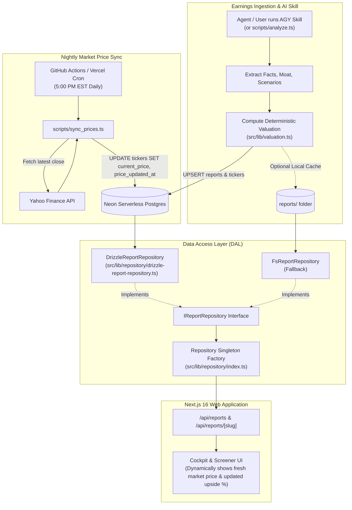

# StressAlpha — Neon Postgres + Drizzle ORM Implementation Spec

> **Document Version:** 1.0.0  
> **Status:** Approved Spec — Ready for Implementation  
> **Target Framework:** Next.js 16 (App Router), Drizzle ORM, `@neondatabase/serverless`  
> **Date:** September 2026  

---

## 1. Executive Summary & Goals

### 1.1 Objective
Transition StressAlpha from a static local filesystem data store (`reports/` folder) to a scalable, serverless relational database powered by **Neon PostgreSQL** and **Drizzle ORM**. 

### 1.2 Core Goals
1. **Database-Backed Data Access Layer:** Implement `DrizzleReportRepository` adhering to the existing [`IReportRepository`](file:///Users/krding/Projects/stress-alpha/src/lib/repository/types.ts#L40) interface, maintaining 100% backward compatibility with the React 19 frontend and Next.js 16 API routes.
2. **Decoupled Market Pricing (Nightly Price Syncs):** Decouple static quarterly earnings reports from live market stock prices. Fundamental quarterly data (facts, scenarios, moats) updates once a quarter, while market prices update daily. Screener valuation bands and fair value discounts automatically reflect current market realities every morning without re-running quarterly LLM audits.
3. **AI Skill & CLI Persistence:** Upgrade `scripts/analyze.ts` and the `stress-alpha` AI Skill to persist generated artifacts directly into Neon Postgres while preserving local files as an optional artifact cache.
4. **Zero-Friction Dual Mode:** Allow the application to run against Neon when `DATABASE_URL` is configured, while gracefully falling back to `FsReportRepository` for offline development, local demos, and CI testing.

---

## 2. Architecture & Data Flow



---

## 3. Database Schema Design (`src/db/schema.ts`)

The schema decouples **Companies/Tickers** (which receive daily market price updates) from **Quarterly Reports** (which capture frozen earnings snapshots and deterministic valuation models).

```typescript
import {
  pgTable,
  text,
  integer,
  numeric,
  bigint,
  boolean,
  timestamp,
  date,
  serial,
  uniqueIndex,
  index,
} from "drizzle-orm/pg-core";
import type {
  Facts,
  Scenarios,
  ValuationData,
  FinancialModelBaseline,
  MoatCompetitors,
  AnalystEstimates,
  CatalystsData,
  EarningsSentiment,
  FilingExtracts,
  ReactionsData,
} from "@/lib/schemas";

// ---------------------------------------------------------------------------
// 1. Tickers Table (Market pricing & universe coverage)
// ---------------------------------------------------------------------------
export const tickersTable = pgTable("tickers", {
  ticker: text("ticker").primaryKey(), // e.g. "NVDA", "AMZN"
  company: text("company").notNull(),  // e.g. "NVIDIA Corporation"
  sector: text("sector"),              // e.g. "Semiconductors"
  currency: text("currency").default("USD").notNull(),
  
  // Dynamic market pricing (Updated nightly)
  currentPrice: numeric("current_price", { precision: 12, scale: 2 }).notNull(),
  previousClose: numeric("previous_close", { precision: 12, scale: 2 }),
  priceUpdatedAt: timestamp("price_updated_at", { withTimezone: true })
    .defaultNow()
    .notNull(),

  marketCap: bigint("market_cap", { mode: "number" }),
  active: boolean("active").default(true).notNull(),
  createdAt: timestamp("created_at", { withTimezone: true }).defaultNow().notNull(),
});

// ---------------------------------------------------------------------------
// 2. Reports Table (Quarterly earnings & valuation models)
// ---------------------------------------------------------------------------
export const reportsTable = pgTable(
  "reports",
  {
    slug: text("slug").primaryKey(), // e.g. "NVDA-Q2-2027-analysis"
    ticker: text("ticker")
      .notNull()
      .references(() => tickersTable.ticker, { onDelete: "cascade" }),
    quarter: text("quarter").notNull(), // e.g. "Q2 2027"
    year: integer("year").notNull(),     // e.g. 2027
    reportDate: text("report_date").notNull(), // "2026-08-26"
    status: text("status").default("published").notNull(), // 'draft' | 'published' | 'archived'

    // Historical stock price at the moment of report generation
    reportPrice: numeric("report_price", { precision: 12, scale: 2 }).notNull(),

    // Denormalized metrics for fast universe screener querying
    weightedFairValue: numeric("weighted_fair_value", { precision: 12, scale: 2 }).notNull(),
    baseFairValue: numeric("base_fair_value", { precision: 12, scale: 2 }).notNull(),
    bullFairValue: numeric("bull_fair_value", { precision: 12, scale: 2 }).notNull(),
    bearFairValue: numeric("bear_fair_value", { precision: 12, scale: 2 }).notNull(),
    panicFairValue: numeric("panic_fair_value", { precision: 12, scale: 2 }),
    moatRating: text("moat_rating"), // "Wide", "Narrow", "None"
    moatTrend: text("moat_trend"),   // "Widening", "Stable", "Narrowing"
    operatingMarginPct: numeric("operating_margin_pct", { precision: 6, scale: 2 }),
    revenueGrowthPct: numeric("revenue_growth_pct", { precision: 6, scale: 2 }),

    // Strongly-typed JSONB artifact payloads (bound directly to Zod schemas)
    facts: jsonb("facts").$type<Facts>().notNull(),
    scenarios: jsonb("scenarios").$type<Scenarios>().notNull(),
    valuation: jsonb("valuation").$type<ValuationData>().notNull(),
    baseline: jsonb("baseline").$type<FinancialModelBaseline>(),
    moat: jsonb("moat").$type<MoatCompetitors>(),
    estimates: jsonb("estimates").$type<AnalystEstimates>(),
    catalysts: jsonb("catalysts").$type<CatalystsData>(),
    sentiment: jsonb("sentiment").$type<EarningsSentiment>(),
    filing: jsonb("filing").$type<FilingExtracts>(),
    reactions: jsonb("reactions").$type<ReactionsData>(),

    // Cached rendered markdown
    reportMd: text("report_md"),
    reportMdZh: text("report_md_zh"),

    publishedAt: timestamp("published_at", { withTimezone: true }).defaultNow().notNull(),
    updatedAt: timestamp("updated_at", { withTimezone: true }).defaultNow().notNull(),
  },
  (table) => ({
    tickerIdx: index("idx_reports_ticker").on(table.ticker),
    publishedIdx: index("idx_reports_published").on(table.publishedAt),
    tickerQuarterUnique: uniqueIndex("idx_reports_ticker_quarter").on(
      table.ticker,
      table.quarter,
      table.year
    ),
  })
);
```

---

## 4. Decoupled Price Updating & Dynamic Valuation Metrics

### 4.1 The Dynamic Recalculation Mechanism
In the static setup, if NVDA stock moves from $120 to $145 over two months, the upside percentage in the report became stale unless someone re-ran the entire earnings pipeline.

With Neon + Drizzle:
1. **Fixed Targets:** Base Fair Value ($182), Bull Fair Value ($230), and Panic Floor ($95) remain anchored to the fundamental earnings model.
2. **Fresh Market Price:** `tickers.current_price` updates nightly.
3. **Runtime Recalculation:** When `listReports()` or `getReport()` is queried, metrics are decorated with the latest market price:
   $$\text{Current Upside \%} = \frac{\text{Weighted Fair Value} - \text{Live Price}}{\text{Live Price}} \times 100$$
   $$\text{Asymmetry Skew} = \frac{\text{Bull Fair Value} - \text{Live Price}}{\text{Live Price} - \text{Panic Fair Value}}$$

### 4.2 SQL Join in `DrizzleReportRepository`
```typescript
// Enriched listReports() query
const rows = await db
  .select({
    report: reportsTable,
    latestPrice: tickersTable.currentPrice,
    priceUpdatedAt: tickersTable.priceUpdatedAt,
  })
  .from(reportsTable)
  .leftJoin(tickersTable, eq(reportsTable.ticker, tickersTable.ticker))
  .orderBy(desc(reportsTable.publishedAt));

// Compute dynamic upside on the fly:
const effectivePrice = Number(latestPrice ?? report.reportPrice);
const weightedFairValue = Number(report.weightedFairValue);
const upsidePct = Number((((weightedFairValue - effectivePrice) / effectivePrice) * 100).toFixed(2));
```

---

## 5. Implementation Details

### 5.1 Package Dependencies
Add to `package.json`:
```json
{
  "dependencies": {
    "@neondatabase/serverless": "^0.10.4",
    "drizzle-orm": "^0.38.4",
    "dotenv": "^16.4.7"
  },
  "devDependencies": {
    "drizzle-kit": "^0.30.2",
    "tsx": "^4.19.2"
  }
}
```

### 5.2 Database Client (`src/db/index.ts`)
Uses `@neondatabase/serverless` connection pooling designed for Vercel and edge/serverless functions:

```typescript
import { neon } from "@neondatabase/serverless";
import { drizzle } from "drizzle-orm/neon-http";
import * as schema from "./schema";

const sql = neon(process.env.DATABASE_URL!);
export const db = drizzle(sql, { schema });
```

### 5.3 Drizzle Config (`drizzle.config.ts`)
```typescript
import { defineConfig } from "drizzle-kit";
import * as dotenv from "dotenv";

dotenv.config({ path: ".env.local" });

export default defineConfig({
  schema: "./src/db/schema.ts",
  out: "./drizzle",
  dialect: "postgresql",
  dbCredentials: {
    url: process.env.DATABASE_URL!,
  },
});
```

### 5.4 Dual-Mode Repository Factory (`src/lib/repository/index.ts`)
```typescript
import type { IReportRepository } from "./types";
import { FsReportRepository } from "./fs-report-repository";
import { DrizzleReportRepository } from "./drizzle-report-repository";

let defaultRepository: IReportRepository | null = null;

export function getReportRepository(): IReportRepository {
  if (!defaultRepository) {
    if (process.env.DATABASE_URL) {
      defaultRepository = new DrizzleReportRepository();
    } else {
      defaultRepository = new FsReportRepository();
    }
  }
  return defaultRepository;
}
```

---

## 6. Nightly Price Sync Script (`scripts/sync_prices.ts`)

A standalone script that runs daily after market close (e.g. 5:00 PM EST):

```typescript
// scripts/sync_prices.ts
import { db } from "../src/db";
import { tickersTable, priceHistoryTable } from "../src/db/schema";
import { eq } from "drizzle-orm";

async function syncPrices() {
  const tickers = await db.select().from(tickersTable).where(eq(tickersTable.active, true));
  const today = new Date().toISOString().split("T")[0];

  for (const { ticker } of tickers) {
    try {
      // 1. Fetch live quote from Yahoo Finance API (chart endpoint)
      const res = await fetch(`https://query1.finance.yahoo.com/v8/finance/chart/${ticker}?interval=1d`);
      const data = await res.json();
      const meta = data.chart.result[0].meta;
      const latestPrice = meta.regularMarketPrice;
      const prevClose = meta.chartPreviousClose;

      // 2. Update tickers table
      await db
        .update(tickersTable)
        .set({
          currentPrice: String(latestPrice),
          previousClose: String(prevClose),
          priceUpdatedAt: new Date(),
        })
        .where(eq(tickersTable.ticker, ticker));

      // 3. Upsert into price history
      await db
        .insert(priceHistoryTable)
        .values({
          ticker,
          date: today,
          closePrice: String(latestPrice),
        })
        .onConflictDoNothing();

      console.log(`✅ [${ticker}] Updated price: $${latestPrice}`);
    } catch (err) {
      console.error(`❌ [${ticker}] Failed to update price:`, err);
    }
  }
}

syncPrices();
```

### Automation via GitHub Actions (`.github/workflows/nightly-price-sync.yml`)
```yaml
name: Nightly Market Price Sync

on:
  schedule:
    # Runs Mon-Fri at 22:00 UTC (5:00 PM EST / 6:00 PM EDT)
    - cron: '0 22 * * 1-5'
  workflow_dispatch: # Allow manual trigger from GitHub UI

jobs:
  sync-prices:
    runs-on: ubuntu-latest
    steps:
      - uses: actions/checkout@v4
      - uses: actions/setup-node@v4
        with:
          node-version: 20
      - run: npm ci
      - run: npx tsx scripts/sync_prices.ts
        env:
          DATABASE_URL: ${{ secrets.DATABASE_URL }}
```

---

## 7. AI Skill & CLI Persistence Integration

### 7.1 Enhancing `scripts/analyze.ts`
Modify `scripts/analyze.ts` to automatically upsert to Neon when `DATABASE_URL` is present (or when `--save-db` is passed):

```typescript
// In scripts/analyze.ts
import { db } from "../src/db";
import { tickersTable, reportsTable } from "../src/db/schema";

if (process.env.DATABASE_URL) {
  console.log("\n💾 Saving report to Neon Postgres...");

  // 1. Ensure ticker exists in tickers table
  await db.insert(tickersTable).values({
    ticker: facts.ticker,
    company: facts.company,
    currentPrice: String(validatedValuation.currentPrice),
  }).onConflictDoUpdate({
    target: tickersTable.ticker,
    set: { company: facts.company }
  });

  // 2. Upsert full report record
  await db.insert(reportsTable).values({
    slug,
    ticker: facts.ticker,
    quarter: facts.quarter,
    year: extractYear(facts.quarter),
    reportDate: facts.reportDate,
    reportPrice: String(validatedValuation.currentPrice),
    weightedFairValue: String(validatedValuation.weightedFairValue),
    baseFairValue: String(baseScenario.targetPrice),
    bullFairValue: String(bullScenario.targetPrice),
    bearFairValue: String(bearScenario.targetPrice),
    panicFairValue: validatedValuation.stressTest ? String(validatedValuation.stressTest.valuationBands.panic.targetPrice) : null,
    moatRating: moat?.overallMoatRating,
    moatTrend: moat?.moatTrend,
    operatingMarginPct: String(facts.operatingMarginPct),
    revenueGrowthPct: String(facts.revenueGrowthPct),
    facts,
    scenarios,
    valuation: validatedValuation,
    baseline,
    moat,
    estimates,
    catalysts,
    reportMd,
    reportMdZh,
    status: "published",
    publishedAt: new Date(),
  }).onConflictDoUpdate({
    target: reportsTable.slug,
    set: {
      reportPrice: String(validatedValuation.currentPrice),
      weightedFairValue: String(validatedValuation.weightedFairValue),
      facts,
      scenarios,
      valuation: validatedValuation,
      updatedAt: new Date(),
    }
  });

  console.log("  ✅ Report successfully saved to Neon database!");
}
```

### 7.2 Skill Update (`.agents/skills/stress-alpha/SKILL.md`)
Add Step 3b to the skill workflow:
- The agent runs `npx tsx scripts/analyze.ts reports/<SLUG>`.
- The CLI automatically saves to both `reports/<SLUG>/` (local inspectable artifact) and Neon Postgres (production web app database).

---

## 8. Migration Script (`scripts/migrate_to_neon.ts`)

A one-time script that reads the 8 existing folders in `reports/` (NVDA, AMZN, BABA, GEV, GOOGL, LITE, LLY, MU) and seeds the Neon database:

```typescript
// scripts/migrate_to_neon.ts
// 1. Scan reports/ directory
// 2. Parse facts.json, scenarios.json, valuation.json, moat-competitors.json, etc.
// 3. Upsert tickers into tickersTable
// 4. Upsert reports into reportsTable
// 5. Verify row count (8 tickers, 8 reports)
```

---

## 9. Phased Execution Plan

| Phase | Tasks | Deliverables |
| :--- | :--- | :--- |
| **Phase 1: Dependencies & Schema** | Install Drizzle & Neon client; configure `drizzle.config.ts`; define `src/db/schema.ts` and `src/db/index.ts`. Run initial `drizzle-kit push`. | Schema migration applied to Neon; connection verified. |
| **Phase 2: Repository Implementation** | Create `DrizzleReportRepository` implementing `IReportRepository`. Update repository singleton in `src/lib/repository/index.ts`. | Unit tests passing against repository; API routes served from DB. |
| **Phase 3: Migration of Existing Reports** | Build `scripts/migrate_to_neon.ts`. Ingest all 8 existing reports into Neon. | 8 tickers & reports visible in web app with dynamic prices. |
| **Phase 4: Nightly Price Sync Script** | Implement `scripts/sync_prices.ts` and `.github/workflows/nightly-price-sync.yml`. | Stock prices update daily; fair value upside % recalculates automatically. |
| **Phase 5: AI Skill & CLI Persistence** | Update `scripts/analyze.ts` to write to Neon; update `.agents/skills/stress-alpha/SKILL.md`. | Pipeline writes directly to DB on new earnings runs. |
| **Phase 6: Verification & QA** | Run Vitest test suite; verify Cockpit sensitivity sliders, Screener, and Memo mode. | All existing tests pass + new DB integration tests pass. |

---

## 10. Risk Analysis & Mitigations

| Risk | Impact | Mitigation |
| :--- | :--- | :--- |
| **Network Latency from Vercel to Neon** | Low | Neon uses connection pooling via HTTP (`@neondatabase/serverless`). `listReports()` uses single JOIN query returning in `<30ms`. |
| **Yahoo Finance Quote API Rate Limit** | Low | Nightly sync queries each ticker sequentially once per day (8–50 tickers total). Takes `<5 seconds` total. |
| **Missing DB in Local Development** | Zero | Dual-mode repository pattern falls back to `FsReportRepository` when `DATABASE_URL` is not set. Local workflow is never blocked. |
| **JSONB Schema Drift** | Low | Drizzle `$type<T>()` guarantees compile-time validation against `src/lib/schemas.ts`. Runtime writes pass through Zod before DB insertion. |
