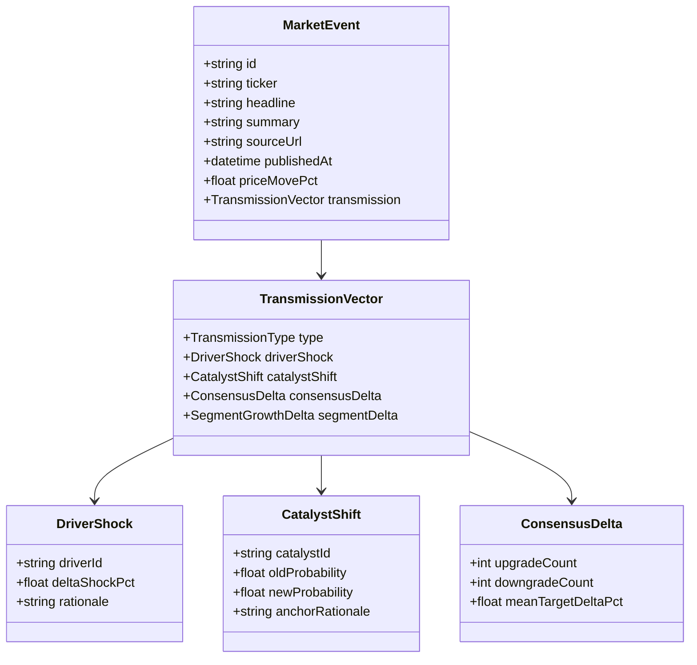

# StressAlpha: News & Catalyst Intelligence Pipeline — Design Document

**Document Status**: Draft / RFC  
**Target Milestone**: v2.4 (News & Cross-Company Intelligence)  
**Authors**: Antigravity & Engineering Team  
**Reviewers**: Lead Quant & Frontend Architect  

---

## 1. Executive Summary & Problem Definition

### 1.1 Objective
Expand StressAlpha from static quarterly 10-Q/10-K audit snapshots to a **dynamic, event-driven equity intelligence cockpit** covering the **S&P 500 and NASDAQ** (~3,500–4,000 tickers). The system must continuously factor in:
1. **Company-specific news and product releases** (e.g., *Meta Muse release*, *DOJ antitrust rulings*).
2. **Cross-company earnings and supply chain disclosures** (e.g., *TSMC CoWoS packaging CapEx* driving NVIDIA/AMD).
3. **Wall Street sell-side rating changes and price target revisions** (e.g., upgrades, downgrades, consensus target dispersion).

### 1.2 The Core Dilemma & Non-Negotiable Architectural Invariant
Standard AI market tools suffer from **uncalibrated price hallucination**: prompting an LLM to predict a stock price move from a news headline produces noisy, ungrounded numbers with high variance and zero balance-sheet discipline.

> [!IMPORTANT]
> **The StressAlpha Invariant**:  
> **LLMs extract and audit qualitative context; pure deterministic TypeScript handles 100% of the arithmetic.**  
> News never dictates price directly. Instead, news is converted into **structural parameter shifts** (upstream driver shocks, catalyst activation probabilities, segment growth deltas, or consensus dispersion logits) which feed into [`computeStressedValuation()`](file:///Users/krding/Projects/stress-alpha/src/lib/valuation.ts#L41) and [`calibrateScenarioProbabilities()`](file:///Users/krding/Projects/stress-alpha/src/lib/valuation.ts#L305).

---

## 2. Ingestion Pipeline: The Free-Tier Barbell Architecture

To scale across 4,000 stocks without enterprise SaaS lock-in ($3,500/mo Finnhub or $100+/mo Massive add-ons), StressAlpha pairs **Massive (Polygon.io)** and **Finnhub** at their free tiers:

```mermaid
flowchart TD
    subgraph External_Data_Sources["External Data Feeds (Free Tier)"]
        MassiveGrouped["Massive (Polygon.io)<br/>GET /v2/aggs/grouped/locale/us/market/stocks<br/>(1 call for 4,000 tickers)"]
        FinnhubRec["Finnhub Free API<br/>GET /stock/recommendation & /price-target<br/>(60 calls/min)"]
        FinnhubNews["Finnhub Free API<br/>GET /company-news?symbol={TICKER}<br/>(60 calls/min)"]
        SEC["SEC EDGAR RSS Feed<br/>8-K, 10-Q, 10-K (Free & Official)"]
    end

    subgraph Ingestion_Engine["Ingestion & Filtering Engine"]
        PriceWorker["Price Sync & Volatility Anomaly Worker"]
        JunkFilter["Deterministic Clickbait Regex & Publisher Filter"]
        EventClassifier["Gemini Flash Extraction Worker (Lightweight JSON)"]
    end

    subgraph Deterministic_Core["StressAlpha Deterministic Core"]
        DAG["Supply Chain Dependency Graph (DAG)"]
        QPCE["QPCE Calibration Engine (Pillar 3 & 4)"]
        StressEngine["Deterministic Valuation Engine (valuation.ts)"]
        DB[(Neon PostgreSQL DB)]
    end

    MassiveGrouped -->|EOD OHLCV All Stocks| PriceWorker
    PriceWorker -->|Detect |R| >= 2.5σ| JunkFilter
    SEC -->|Form 8-K Items 1.01, 2.02, 4.02| JunkFilter
    FinnhubNews -->|Ticker-tagged news| JunkFilter
    FinnhubRec -->|Consensus & Targets| QPCE

    JunkFilter -->|Material Headlines Only| EventClassifier
    EventClassifier -->|Structured Shock JSON| DAG
    DAG -->|Cascade Upstream Shocks| StressEngine
    QPCE -->|Calibrated Scenario Weights| StressEngine
    StressEngine -->|Instant recalculation < 150ms| DB
```

### 2.1 Cadence & Rate-Limit Optimization Across 4,000 Stocks
1. **Universe Pricing (1 API Call)**:
   - Polled once nightly at market close (4:30 PM EST) via Massive’s Grouped Daily endpoint.
   - Computes abnormal returns ($|R_{\text{abnormal}}| \ge 2.5\sigma$) to flag tickers experiencing shock volatility.
2. **Targeted Finnhub News & Consensus Polling**:
   - **Tier 1 (Core ~600 stocks - S&P 500 + NASDAQ 100)**: Nightly poll for price target revisions and recommendations (10 minutes total @ 60 req/min).
   - **Tier 2 (Event-Driven Movers & Reporters)**: Any ticker with an SEC 8-K or $|R| \ge 2.5\sigma$ is immediately queried for `/company-news`.
   - **Tier 3 (Remaining 3,000 NASDAQ stocks)**: Weekly rolling audit (600 stocks/day).

---

## 3. The Fundamental Transmission Engine: Bridging News to Valuation

Every approved news item must be converted into a typed **Transmission Vector**. If an event does not map to at least one vector, it is stored as qualitative context but **cannot alter the valuation engine**.



### 3.1 The 4 Transmission Channels

| Transmission Channel | Trigger Example | Target Invariant in Engine | Deterministic Effect |
| :--- | :--- | :--- | :--- |
| **1. Upstream Driver Shock** | TSMC raises 3nm/CoWoS CapEx by $+20\%$ | [`UpstreamDriver.defaultShockPct`](file:///Users/krding/Projects/stress-alpha/src/lib/schemas.ts#L129) | Cascades through exposure share and elasticity to recalculate revenue, gross margin, operating leverage, and valuation bands in [`computeStressedValuation()`](file:///Users/krding/Projects/stress-alpha/src/lib/valuation.ts#L41). |
| **2. Catalyst Probability Shift** | Meta releases Muse AI suite (enterprise general availability) | [`Catalyst.probability`](file:///Users/krding/Projects/stress-alpha/src/lib/schemas.ts#L110) | Shifts catalyst activation probability from $0.30 \to 0.75$, shifting scenario weights in [`calibrateScenarioProbabilities()`](file:///Users/krding/Projects/stress-alpha/src/lib/valuation.ts#L305). |
| **3. Wall Street Revision Momentum** | 4 brokerages upgrade ticker, raising mean target by $+8\%$ | [`AnalystEstimates.consensus`](file:///Users/krding/Projects/stress-alpha/src/lib/schemas.ts#L470) | Updates QPCE Pillar 3 consensus bullish ratio and target dispersion, modifying logit adjustments for Bull vs Panic. |
| **4. Structural Segment Revision** | 8-K announces loss of major OEM client or contract win | [`Facts.segments`](file:///Users/krding/Projects/stress-alpha/src/lib/schemas.ts#L21) | Adjusts segment baseline revenue growth rate directly. |

---

## 4. UI/UX Design Specifications: The Cockpit "News & Catalysts" Experience

### 4.1 Benchmarking Against Perplexity Finance
* **What Perplexity Finance does well**: Clean card layout, synthesized "Key Takeaways" with inline numbered citations `[1]`, clear bullish/bearish badges, and structured analyst target bars.
* **Where Perplexity Finance falls short**: Purely descriptive. It gives no financial flow-through—you cannot see *how* the news changes the EPS, multiple, or margin of safety, nor can you stress-test it.
* **StressAlpha’s Institutional Advantage**: 
  - Every news card displays its **Fundamental Transmission Vector**.
  - A 1-click **"⚡ Simulate in Cockpit"** button loads the event’s implied shocks into the cockpit sliders in real-time.

```
┌──────────────────────────────────────────────────────────────────────────────────────────────────┐
│  STRESSALPHA COCKPIT  •  NVDA  •  Q2 2027                                  [Share & Export] [🌙] │
├──────────────────────────────────────────────────────────────────────────────────────────────────┤
│  [1. Valuation]  [2. Estimates]  [3. Moat]  [4. Segments]  [5. Catalysts]  [6. News & Pulse 🔴]  │
├──────────────────────────────────────────────────────────────────────────────────────────────────┤
│                                                                                                  │
│  LATEST MARKET PULSE                                                                             │
│  "TSMC Expands CoWoS Packaging Allocation by +25% Following Hyperscaler AI Cluster Commitments" │
│  Published: 3h ago  •  Source: Bloomberg / Commercial Times [1]  •  Price Reaction: +3.2%         │
│                                                                                                  │
│  ┌────────────────────────────────────────────────────────────────────────────────────────────┐  │
│  │ ⚡ TRANSMISSION CHANNEL: Upstream Driver Shock                                              │  │
│  │ • Driver: Hyperscaler Cloud CapEx (Exposure: 70%, Elasticity: 0.85)                        │  │
│  │ • Implied Revenue Delta: +$4.20B (+5.9%)  •  Implied EPS Delta: +$0.14                     │  │
│  │ • Stressed WFV Impact: $148.50 → $156.20 (+5.2%)                                           │  │
│  │                                                                                            │  │
│  │ [ ⚡ Simulate in Cockpit Sliders ]   [ 📄 View Source Filing ]   [ 🔍 Inspect Elasticity ]  │  │
│  └────────────────────────────────────────────────────────────────────────────────────────────┘  │
│                                                                                                  │
│  NEWS TIMELINE & EVENT AUDIT (Last 30 Days)                                                      │
│  ─────────────────────────────────────────────────────────────────────────────────────────────  │
│  [All]  [Upstream & Supply Chain (3)]  [Product Catalysts (2)]  [Analyst Revisions (8)]  [SEC (1)] │
│                                                                                                  │
│  • 2026-09-22: Morgan Stanley Raises Target to $165 (Overweight) ........... [QPCE Bull +0.15]   │
│  • 2026-09-19: Meta Releases Muse Multimodal Engine ....................... [Catalyst +12%]     │
│  • 2026-09-14: Form 8-K: Supply Agreement Amendment with Foxconn .......... [Verified SEC]      │
└──────────────────────────────────────────────────────────────────────────────────────────────────┘
```

### 4.2 Key UI Components to Implement
1. **The News & Pulse Tab (`NewsTab.tsx`)**:
   - Location: Slot 6 in the main tab navigation (accessible via shortcut key `6`).
   - Badge Counter: Unread / material events in the last 7 trading days.
   - Dual-theme compliant (Obsidian `#07090e` dark mode and FactSet slate-white light mode).
2. **Transmission Vector Cards**:
   - Visual badges designating the transmission type:
     - ⚡ `Upstream Shock` (Emerald/Cyan)
     - 🎯 `Catalyst Shift` (Indigo)
     - 📊 `Consensus Skew` (Amber)
     - 🏛️ `SEC Regulatory` (Rose)
   - Calculated impact pill: `+4.2% WFV impact` computed in deterministic TypeScript.
3. **Interactive "Simulate in Cockpit" Action**:
   - When the user clicks **Simulate**, the app pushes the event's parameters into the parent state (`onDriverShockChange`, `onGrossMarginDeltaChange`) and smoothly transitions to the **Valuation Regimes** view, showing how the stock responds.

---

## 5. Technical Implementation Blueprint

### 5.1 Database Schema Extensions ([`src/db/schema.ts`](file:///Users/krding/Projects/stress-alpha/src/db/schema.ts))

```typescript
// 1. Immutable Market & News Events Table
export const marketEventsTable = pgTable("market_events", {
  id: text("id").primaryKey(), // nanoid or uuid
  ticker: text("ticker")
    .notNull()
    .references(() => tickersTable.ticker, { onDelete: "cascade" }),
  title: text("title").notNull(),
  summary: text("summary").notNull(),
  sourceUrl: text("source_url"),
  publisher: text("publisher").notNull(),
  publishedAt: timestamp("published_at", { withTimezone: true }).notNull(),
  eventType: text("event_type").notNull(), // 'upstream_earnings' | 'product_release' | 'analyst_rating' | 'sec_filing'
  
  // Abnormal market reaction at time of event
  priceMovePct: numeric("price_move_pct", { precision: 6, scale: 2 }),
  abnormalReturnSigma: numeric("abnormal_return_sigma", { precision: 4, scale: 2 }),
  
  // Deterministic Transmission Vector
  transmissionType: text("transmission_type"), // 'driver_shock' | 'catalyst_prob' | 'qpce_skew' | 'none'
  transmissionPayload: jsonb("transmission_payload").$type<{
    driverId?: string;
    deltaShockPct?: number;
    catalystId?: string;
    newProbability?: number;
    analystAction?: {
      firm: string;
      action: "Upgraded" | "Downgraded" | "TargetRaised" | "TargetLowered";
      priorTarget?: number;
      newTarget: number;
    };
  }>(),

  // Pre-calculated deterministic impact
  impliedWfvImpactPct: numeric("implied_wfv_impact_pct", { precision: 6, scale: 2 }),
  
  createdAt: timestamp("created_at", { withTimezone: true }).defaultNow().notNull(),
}, (table) => [
  index("idx_market_events_ticker").on(table.ticker),
  index("idx_market_events_published").on(table.publishedAt),
  index("idx_market_events_type").on(table.eventType),
]);

// 2. Cross-Company Supply Chain Graph
export const upstreamDependenciesTable = pgTable("upstream_dependencies", {
  id: text("id").primaryKey(),
  sourceTicker: text("source_ticker").notNull(), // e.g. "TSM"
  targetTicker: text("target_ticker").notNull(), // e.g. "NVDA"
  driverId: text("driver_id").notNull(),         // e.g. "advanced-packaging"
  exposureShare: numeric("exposure_share", { precision: 4, scale: 2 }).notNull(),
  elasticity: numeric("elasticity", { precision: 4, scale: 2 }).notNull(),
}, (table) => [
  uniqueIndex("idx_upstream_dep_pair").on(table.sourceTicker, table.targetTicker, table.driverId),
]);
```

### 5.2 Zod Schemas ([`src/lib/schemas.ts`](file:///Users/krding/Projects/stress-alpha/src/lib/schemas.ts))
Add `MarketEventSchema`, `TransmissionPayloadSchema`, and `MarketEventsListSchema` to ensure strict typing across API routes, UI components, and export cards.

### 5.3 Centralized Translations ([`src/lib/i18n.ts`](file:///Users/krding/Projects/stress-alpha/src/lib/i18n.ts))
Add a dedicated `news` dictionary in both English and Chinese:
- `news.tabTitle`: "News & Pulse" / "即时异动与催化"
- `news.simulateButton`: "Simulate in Cockpit" / "一键带入驾驶舱推演"
- `news.wfvImpact`: "Implied WFV Impact" / "加权公允估值推演影响"
- `news.transmissionChannels`: "Transmission Mechanism" / "传导机制"

*(Strictly adheres to the rule prohibiting inline `isZh ? :` checks!)*

*(Strictly adheres to the rule prohibiting inline `isZh ? :` checks!)*

---

## 6. Fair Value Revision History & Audit Trail (The Valuation Ledger)

To eliminate the "black-box" dilemma and prevent look-ahead bias, StressAlpha maintains an immutable **Fair Value Revision Ledger**. Users can inspect exactly *why* and *when* a valuation shifted between earnings quarters.

### 6.1 Architectural Principles (Aligned Decisions)
1. **Event-Driven Cadence (Option A)**:
   - Revisions are logged **strictly when an underlying fundamental driver changes** (e.g., quarterly 10-Q/10-K filing, SEC Form 8-K, peer earnings shock, or material sell-side consensus revision wave).
   - Daily market price ticks do **not** generate log entries (price ticks alter *margin of safety* and *upside %*, but not the model's *fair value*).
2. **Full State Diff**:
   - Each revision snapshot records the complete before/after state:
     - Outcome Bands: `priorWfv` $\to$ `newWfv`, Bull, Base, Panic Floor targets.
     - Perturbed Inputs: Driver ID and delta shock % (e.g. `hyperscaler-capex: 0% → +20%`).
     - Calibrated Probabilities: Softmax logit shifts and resulting regime weights (e.g. `Bull: 35% → 42%, Panic: 15% → 10%`).
     - Trigger Context: Linked `marketEventId` or `filingQuarter` with a human-readable thesis summary.
3. **Cockpit UI Placement: Valuation Tab**:
   - Integrated directly into the **Valuation Workspace Tab** (`ScenariosTab.tsx` / `ValuationTab.tsx`), positioned adjacent to the scenario probability tree and sensitivity heatmap.
   - Renders a clean FactSet/Bloomberg-style **Valuation Revision Ledger**:
     - `Date` | `Trigger Event` | `Prior WFV` | `New WFV` | `Δ%` | `Impacted Drivers & Probabilities` | `Source Citation`
4. **No Time-Machine Complexity**:
   - The ledger functions purely as a transparent, auditable historical ledger without time-travel slider rollback state.

### 6.2 Database Schema for Valuation Revisions (`valuation_revisions`)

```typescript
export const valuationRevisionsTable = pgTable(
  "valuation_revisions",
  {
    id: text("id").primaryKey(), // nanoid or uuid
    ticker: text("ticker")
      .notNull()
      .references(() => tickersTable.ticker, { onDelete: "cascade" }),
    revisionDate: timestamp("revision_date", { withTimezone: true }).notNull(),
    triggerType: text("trigger_type").notNull(), // 'quarterly_filing' | 'peer_earnings_shock' | 'sec_8k' | 'consensus_wave' | 'catalyst_activation'
    triggerEventId: text("trigger_event_id")
      .references(() => marketEventsTable.id, { onDelete: "set null" }),
    headline: text("headline").notNull(),
    rationale: text("rationale").notNull(),

    // Outcome Values
    priorWfv: numeric("prior_wfv", { precision: 12, scale: 2 }).notNull(),
    newWfv: numeric("new_wfv", { precision: 12, scale: 2 }).notNull(),
    wfvDeltaPct: numeric("wfv_delta_pct", { precision: 6, scale: 2 }).notNull(),

    // Full State Diff Payload
    fullStateDiff: jsonb("full_state_diff").$type<{
      priorRegimes: { bull: number; base: number; panic: number };
      newRegimes: { bull: number; base: number; panic: number };
      priorProbabilities?: { bull: number; base: number; panic: number };
      newProbabilities?: { bull: number; base: number; panic: number };
      driverShocksApplied?: Record<string, number>;
      grossMarginBpsDelta?: number;
      fixedOpexShiftPct?: number;
    }>().notNull(),

    createdAt: timestamp("created_at", { withTimezone: true }).defaultNow().notNull(),
  },
  (table) => [
    index("idx_val_revisions_ticker").on(table.ticker),
    index("idx_val_revisions_date").on(table.revisionDate),
  ]
);
```

---

## 7. Implementation Phases & Milestones

```
Phase 1: Ingestion & Junk Filter (Week 1)
├── Massive grouped daily EOD ingestion script
├── Finnhub company-news & recommendation poller
└── Rule-based regex clickbait & syndication filter

Phase 2: Transmission Engine & Supply Chain DAG (Week 2)
├── Define Upstream Dependency table & relationships (TSMC → NVDA, Hyperscalers → Hardware)
├── Gemini Flash extraction prompt for transmission JSON
└── TypeScript deterministic valuation cascade test suite

Phase 3: Valuation Revision Ledger & History (Week 3)
├── Implement valuationRevisionsTable and Drizzle repository methods
├── Hook revision recording into news transmission execution
└── Render Valuation Revision Ledger inside ValuationTab.tsx

Phase 4: UI Implementation & Cockpit Simulation (Week 4)
├── Build NewsTab.tsx with Perplexity-style cited cards
├── Implement "Simulate in Cockpit" slider injection
└── Add keyboard shortcut '6' and i18n dictionary entries

Phase 5: S&P 500 / NASDAQ Rollout (Week 5)
├── Seed upstream dependency DAG for top 100 bellwethers
├── Run batch validation suite across 600 core tickers
└── Production CI verification (tsc, vitest, build)
```

---

## 8. Resolved Architectural Decisions

1. **Revision Log Cadence**: **Option A (Event-Driven Only)** — revisions are recorded solely upon fundamental driver changes (10-Q/10-K, 8-K, peer shocks, consensus shifts).
2. **Snapshot Granularity**: **Full State Diff** — tracks outcome targets, driver delta shocks, and calibrated scenario probabilities.
3. **UI Placement**: Inside the **Valuation Tab** alongside the scenario tree.
4. **Time Machine**: Out of scope / unnecessary; emphasis is on audit trail clarity and parameter accountability.
