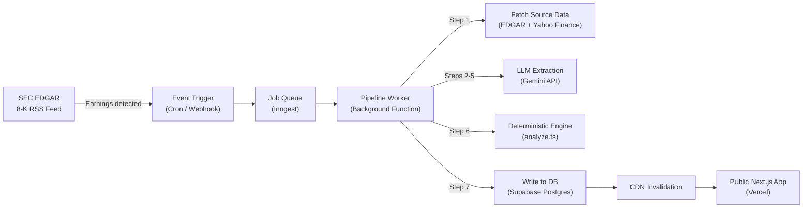
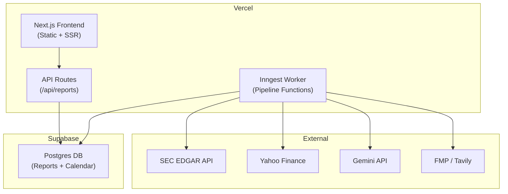

# StressAlpha: Real-Time Public Platform Spec

> **Status:** Draft — architectural spec for future implementation
> **Author:** Kevin Ding + Antigravity
> **Date:** September 15, 2026

---

## 1. Vision

Transform StressAlpha from a local, file-based earnings analysis tool into a **public real-time platform** that automatically generates institutional-grade equity analysis within minutes of an earnings release — no human review step required.

### Current State → Target State

| Dimension | Current | Target |
|-----------|---------|--------|
| Coverage | 8 manually-curated tickers | 500+ tickers, auto-triggered |
| Latency | Hours (human-in-the-loop) | 5–15 min post-earnings |
| Data store | Local `reports/` filesystem | Postgres + CDN |
| Deployment | `localhost:3000` | Public Vercel deployment |
| Pipeline trigger | Human runs AGY skill | Automated earnings event detection |
| LLM execution | AGY local (Gemini Pro plan) | Gemini API (direct calls from worker) |
| Cost model | $0 (bundled in Gemini Pro) | ~$0.50–1.50/ticker in API tokens |

---

## 2. Architecture Overview



---

## 3. Earnings Event Detection

### Option A: SEC EDGAR RSS Polling (Recommended)

SEC publishes 8-K filings (which include earnings releases) via a public RSS feed with near-real-time updates.

- **Endpoint:** `https://efts.sec.gov/LATEST/search-index?q=%228-K%22&dateRange=custom&startdt=YYYY-MM-DD&enddt=YYYY-MM-DD`
- **Polling interval:** Every 15 minutes during earnings season (Jan–Feb, Apr–May, Jul–Aug, Oct–Nov)
- **Cost:** Free
- **Mapping:** SEC CIK → Ticker via the [SEC company tickers JSON](https://www.sec.gov/files/company_tickers.json)

### Option B: Financial Data API Webhook

- **Polygon.io** or **Financial Modeling Prep (FMP)** offer earnings event webhooks
- FMP free tier: 250 API calls/day (sufficient for earnings calendar checks)
- More reliable ticker mapping than raw EDGAR

### Option C: Earnings Calendar Cron (Simplest)

- Pre-load the known earnings calendar (available from Yahoo Finance, Nasdaq, FMP)
- Cron fires at market close on each earnings date
- Doesn't handle surprise announcements or pre-market releases instantly
- Good enough for V1

> [!TIP]
> **Recommended for V1:** Start with Option C (earnings calendar cron). Upgrade to Option A (EDGAR RSS) for V2 when latency matters.

---

## 4. Source Data Acquisition

Each pipeline run needs raw source material before LLM extraction. All sources below are free or low-cost:

| Data Needed | Source | API | Cost | Latency |
|-------------|--------|-----|------|---------|
| Earnings press release | SEC EDGAR full-text search | EDGAR EFTS API | Free | Real-time |
| 10-Q / 10-K filing | SEC EDGAR | EDGAR filing API | Free | Same-day |
| Current stock price | Yahoo Finance | `yfinance` | Free | Real-time |
| Analyst consensus + PTs | Yahoo Finance | `yfinance` | Free | Real-time |
| Earnings call transcript | FMP or Seeking Alpha | REST API | $30–100/mo | ~1 hour post-call |
| Competitor financial data | FMP / Yahoo Finance | REST API | Free tier available | Real-time |
| News / catalyst research | Tavily or Perplexity API | REST API | ~$0.01/search | Real-time |

### Key Constraint: Earnings Call Transcripts

Transcripts are the most valuable source for `earnings-sentiment.json` and `catalysts.json`, but they're typically available **1–2 hours after the call ends**, not at the moment of the press release. The pipeline should handle this gracefully:

1. **Phase 1 (T+0 min):** Generate `facts.json`, `scenarios.json`, `analyst-estimates.json` from press release + financial APIs
2. **Phase 2 (T+2 hours):** Enrich with `earnings-sentiment.json`, update `catalysts.json` once transcript is available

---

## 5. Pipeline Worker Design

### Technology Choice

| Option | Max Duration | Cost | Fit |
|--------|-------------|------|-----|
| Vercel Serverless Functions | 5 min (Pro) | Included | ❌ Too short |
| Vercel Background Functions | 15 min (Pro) | Included | ✅ Tight but viable |
| **Inngest on Vercel** | Unlimited (step functions) | Free tier: 5K runs/mo | ✅ Best fit |
| Cloudflare Workflows | Unlimited | Workers Paid: $5/mo | ✅ Alternative |
| Railway / Fly.io worker | Unlimited | ~$5–20/mo | ✅ Fallback |

> [!IMPORTANT]
> **Recommended: Inngest.** It provides durable, multi-step functions with automatic retries, runs on Vercel infrastructure, and handles the 5–15 minute pipeline duration without timeout issues. Each extraction stage becomes a separate "step" with its own retry logic.

### Pipeline Steps (Inngest Function)

```typescript
// Pseudocode — each step is independently retryable
export const analyzeEarnings = inngest.createFunction(
  { id: "analyze-earnings" },
  { event: "earnings/reported" },
  async ({ event, step }) => {
    const { ticker, quarter, year, filingUrl } = event.data;

    // Step 1: Fetch source data
    const sources = await step.run("fetch-sources", async () => {
      const pressRelease = await fetchEdgarFiling(filingUrl);
      const price = await fetchYahooPrice(ticker);
      const financials = await fetchFMPEarnings(ticker, quarter, year);
      return { pressRelease, price, financials };
    });

    // Step 2: LLM → facts.json
    const facts = await step.run("extract-facts", async () => {
      return await callGemini(STAGE1_PROMPT, sources);
    });

    // Step 3: LLM → scenarios.json
    const scenarios = await step.run("extract-scenarios", async () => {
      return await callGemini(STAGE3_PROMPT, { facts, sources });
    });

    // Step 4: LLM → moat-competitors.json
    const moat = await step.run("extract-moat", async () => {
      const peerData = await searchWeb(`${ticker} competitors market share`);
      return await callGemini(STAGE1B_PROMPT, { facts, peerData });
    });

    // Step 5: Yahoo Finance → analyst-estimates.json
    const estimates = await step.run("fetch-estimates", async () => {
      return await fetchAnalystEstimates(ticker, sources.price);
    });

    // Step 6: Deterministic valuation
    const valuation = await step.run("compute-valuation", async () => {
      return computeValuation({ facts, scenarios });
    });

    // Step 7: Write to DB
    await step.run("publish", async () => {
      await supabase.from("reports").upsert({
        ticker, quarter, year,
        facts, scenarios, moat, estimates, valuation,
        status: "published",
        published_at: new Date(),
      });
    });
  }
);
```

### LLM API Costs Per Run

| Stage | Input Tokens (est.) | Output Tokens (est.) | Cost (Gemini 2.5 Flash) |
|-------|--------------------|--------------------|----------------------|
| facts.json | ~8K (press release) | ~2K | $0.006 |
| scenarios.json | ~4K (facts + context) | ~1.5K | $0.004 |
| moat-competitors.json | ~10K (web search results) | ~3K | $0.01 |
| catalysts.json | ~6K | ~1.5K | $0.005 |
| earnings-sentiment.json | ~15K (transcript) | ~2K | $0.01 |
| **Total per ticker** | | | **~$0.04–0.10** |

> [!NOTE]
> Gemini 2.5 Flash pricing is dramatically cheaper than initially estimated. At $0.05/ticker, running 500 tickers per quarter costs ~$25. Even Gemini 2.5 Pro at 10x the price would be ~$250/quarter — trivial.

---

## 6. Database Schema

### Technology: Supabase (Postgres)

Chosen for: free tier, real-time subscriptions, row-level security, hosted Postgres with REST API.

```sql
-- Core reports table
CREATE TABLE reports (
  id            UUID DEFAULT gen_random_uuid() PRIMARY KEY,
  ticker        TEXT NOT NULL,
  company       TEXT,
  quarter       TEXT NOT NULL,        -- e.g. "Q2 2027"
  year          INTEGER NOT NULL,
  slug          TEXT UNIQUE NOT NULL,  -- e.g. "NVDA-Q2-2027-analysis"

  -- Artifact JSON columns (JSONB for query flexibility)
  facts         JSONB,
  scenarios     JSONB,
  valuation     JSONB,
  moat          JSONB,
  estimates     JSONB,
  catalysts     JSONB,
  sentiment     JSONB,
  filing        JSONB,
  reactions     JSONB,
  baseline      JSONB,

  -- Chinese translations
  facts_zh      JSONB,
  scenarios_zh  JSONB,
  moat_zh       JSONB,
  estimates_zh  JSONB,

  -- Rendered reports (cached markdown)
  report_md     TEXT,
  report_md_zh  TEXT,

  -- Metadata
  status        TEXT DEFAULT 'draft',  -- draft | published | error
  source_url    TEXT,                  -- SEC EDGAR filing URL
  current_price NUMERIC,
  published_at  TIMESTAMPTZ,
  created_at    TIMESTAMPTZ DEFAULT NOW(),
  updated_at    TIMESTAMPTZ DEFAULT NOW()
);

-- Indexes for common queries
CREATE INDEX idx_reports_ticker ON reports (ticker);
CREATE INDEX idx_reports_status ON reports (status);
CREATE INDEX idx_reports_published ON reports (published_at DESC);
CREATE UNIQUE INDEX idx_reports_ticker_quarter ON reports (ticker, quarter, year);

-- Coverage universe (which tickers to track)
CREATE TABLE coverage (
  ticker        TEXT PRIMARY KEY,
  company       TEXT NOT NULL,
  sector        TEXT,
  market_cap    BIGINT,
  enabled       BOOLEAN DEFAULT TRUE,
  added_at      TIMESTAMPTZ DEFAULT NOW()
);

-- Earnings calendar (pre-loaded)
CREATE TABLE earnings_calendar (
  id            UUID DEFAULT gen_random_uuid() PRIMARY KEY,
  ticker        TEXT NOT NULL REFERENCES coverage(ticker),
  report_date   DATE NOT NULL,
  quarter       TEXT NOT NULL,
  year          INTEGER NOT NULL,
  status        TEXT DEFAULT 'pending',  -- pending | processing | completed | failed
  processed_at  TIMESTAMPTZ
);
```

---

## 7. API Route Migration

The current Next.js API routes read from `fs`. The migration is a **surgical swap** — two files change, frontend stays identical.

### Current: `/api/reports/route.ts`
```typescript
// FROM: filesystem scan
const entries = fs.readdirSync(reportsDir, { withFileTypes: true });
```

### Target: `/api/reports/route.ts`
```typescript
// TO: database query
const { data: reports } = await supabase
  .from('reports')
  .select('slug, ticker, company, quarter, current_price, status, published_at')
  .eq('status', 'published')
  .order('published_at', { ascending: false });
```

### Current: `/api/reports/[slug]/route.ts`
```typescript
// FROM: 10+ fs.readFileSync calls
const factsRaw = readFileJson("facts.json");
const scenariosRaw = readFileJson("scenarios.json");
// ...
```

### Target: `/api/reports/[slug]/route.ts`
```typescript
// TO: single database read
const { data: report } = await supabase
  .from('reports')
  .select('*')
  .eq('slug', slug)
  .eq('status', 'published')
  .single();
```

> [!IMPORTANT]
> The frontend (`page.tsx`, all tab components, `EstimatesTab.tsx`, `MemoView.tsx`) requires **zero changes**. It already consumes JSON from the API — it doesn't care if the JSON came from `fs` or Postgres.

---

## 8. Deployment Architecture



### Cost Estimate (Monthly)

| Service | Tier | Cost |
|---------|------|------|
| Vercel | Pro | $20/mo |
| Supabase | Free (up to 500MB, 50K rows) | $0 |
| Inngest | Free (5,000 runs/mo) | $0 |
| Gemini API | Pay-per-use (~500 runs/quarter) | ~$8/mo |
| FMP (financial data) | Free tier (250 calls/day) | $0 |
| Domain | `.com` | ~$1/mo |
| **Total** | | **~$29/mo** |

---

## 9. Quality Without Human Review

Removing the human review step means the pipeline must be **self-validating**. Existing safeguards and additions needed:

### Already Built ✅
- **Zod schema validation** — every artifact is parsed through strict TypeScript schemas; malformed LLM output is rejected
- **Deterministic valuation engine** — math is never LLM-generated; only extracted inputs feed the calculation
- **Income quality guardrail** — the stage1 prompt explicitly isolates non-operating items

### Needs to Be Added 🔧
- **Sanity bounds on LLM outputs:**
  - EPS must be within 50% of consensus estimate (cross-check with Yahoo Finance)
  - P/E multiples must be within historical range for the sector (5x–80x)
  - Scenario probabilities must sum to 1.0 (already enforced by schema)
  - Stock price in report must match Yahoo Finance (prevents the MU $145 bug)
- **Automated cross-validation:**
  - Compare `facts.json` revenue/EPS against FMP's reported actuals
  - Flag reports where valuation diverges >50% from analyst consensus
- **Fallback behavior:**
  - If any LLM extraction fails validation, retry once with stricter prompt
  - If retry fails, publish partial report (estimates + facts only) and flag for manual review
  - Never publish a report with failed `facts.json` or `scenarios.json`

---

## 10. Migration Path

### Phase 1: Database + Deploy (Weekend Project)
- [ ] Set up Supabase project, run schema migration
- [ ] Create `scripts/migrate-reports.ts` — bulk import existing 8 reports from `reports/` into DB
- [ ] Swap the two API routes (`/api/reports`, `/api/reports/[slug]`) to read from Supabase
- [ ] Deploy to Vercel
- [ ] Verify all 8 reports render correctly on public URL

### Phase 2: Automated Pipeline (1 Week)
- [ ] Set up Inngest on Vercel
- [ ] Port prompt templates into Gemini API calls (`callGemini()` helper)
- [ ] Build pipeline worker function with step-by-step extraction
- [ ] Port `fetch_analyst_estimates.py` to TypeScript (or call via subprocess)
- [ ] Port `analyze.ts` valuation engine to run in-worker
- [ ] Add sanity bounds and cross-validation checks
- [ ] Test end-to-end: manually trigger pipeline for 1 ticker → verify published report

### Phase 3: Event-Driven Triggers (1 Week)
- [ ] Load earnings calendar into `earnings_calendar` table
- [ ] Build cron function: check calendar daily → enqueue pipeline runs
- [ ] Add SEC EDGAR RSS polling as upgrade path
- [ ] Add error alerting (Inngest has built-in failure notifications)
- [ ] Load coverage universe (S&P 500 or custom watchlist)

### Phase 4: Polish (Ongoing)
- [ ] Public landing page with ticker search
- [ ] SEO: dynamic `<meta>` tags per report for social sharing
- [ ] Email/push notifications when new reports publish
- [ ] Historical report archive (multiple quarters per ticker)
- [ ] User accounts + watchlists (Supabase Auth)

---

## 11. Open Questions

1. **Coverage universe:** Start with S&P 500? Mag 7 + sector picks? User-requested tickers?
2. **Transcript access:** Pay for FMP transcript API ($30/mo) or skip `earnings-sentiment.json` for V1?
3. **Chinese translations:** Run a second LLM pass to translate, or drop bilingual support for the public version?
4. **Branding:** Keep "StressAlpha" name? Domain?
5. **Monetization:** Free with ads? Freemium (5 reports free, subscribe for full access)? API access?

---

## 12. Key Risks

| Risk | Likelihood | Mitigation |
|------|-----------|------------|
| LLM hallucinating financial numbers | Medium | Cross-validate EPS/revenue against FMP actuals |
| Yahoo Finance API rate limiting | Low | Cache aggressively, add exponential backoff |
| SEC EDGAR format changes | Low | EDGAR has been stable for years; monitor for 10-K/8-K schema changes |
| Gemini API outage during earnings rush | Medium | Queue with retry; all earnings happen in a ~3 week window |
| Poor scenario quality without human review | Medium | Sanity bounds + automated flagging for outlier valuations |
| `yfinance` breaking (unofficial API) | Medium | Fallback to FMP analyst estimates endpoint |

---

## Appendix: Files That Change vs. Stay

### Zero Changes Required
- `src/app/page.tsx` (frontend)
- `src/components/tabs/EstimatesTab.tsx`
- `src/components/MemoView.tsx`
- `src/lib/schemas.ts` (Zod schemas — used by both worker and frontend)
- `src/lib/valuation.ts` (deterministic engine)
- `src/lib/report.ts` (markdown renderer)
- `src/lib/i18n.ts`
- `prompts/*.md` (prompt templates — reused as LLM system prompts)

### Needs Modification
- `src/app/api/reports/route.ts` → swap `fs` for Supabase query
- `src/app/api/reports/[slug]/route.ts` → swap `fs` for Supabase query

### New Files
- `src/lib/supabase.ts` — Supabase client
- `src/inngest/functions/analyze-earnings.ts` — pipeline worker
- `src/inngest/client.ts` — Inngest client
- `scripts/migrate-reports.ts` — one-time migration from `reports/` to DB
- `supabase/migrations/001_initial_schema.sql` — database schema
